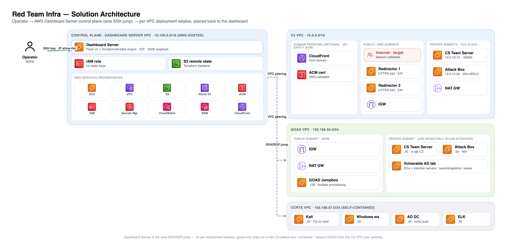
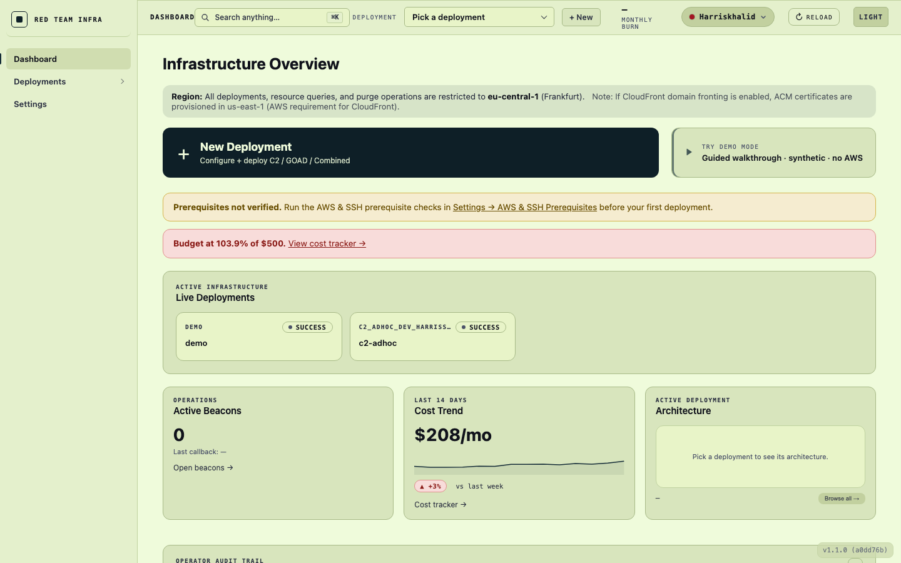
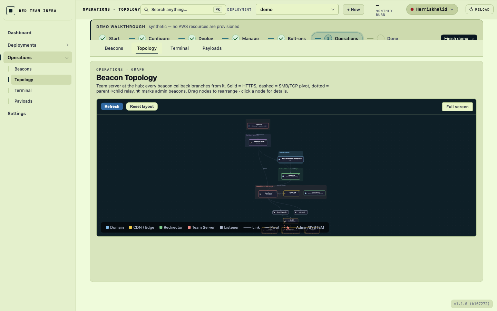
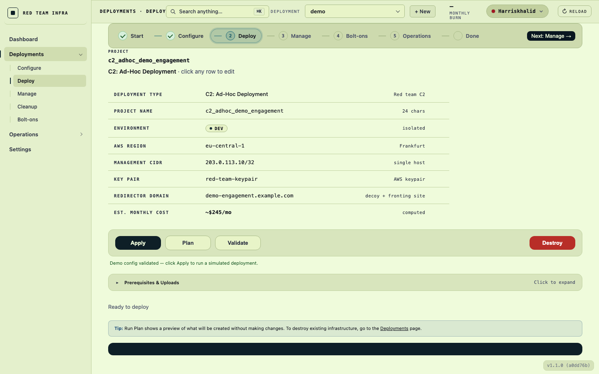
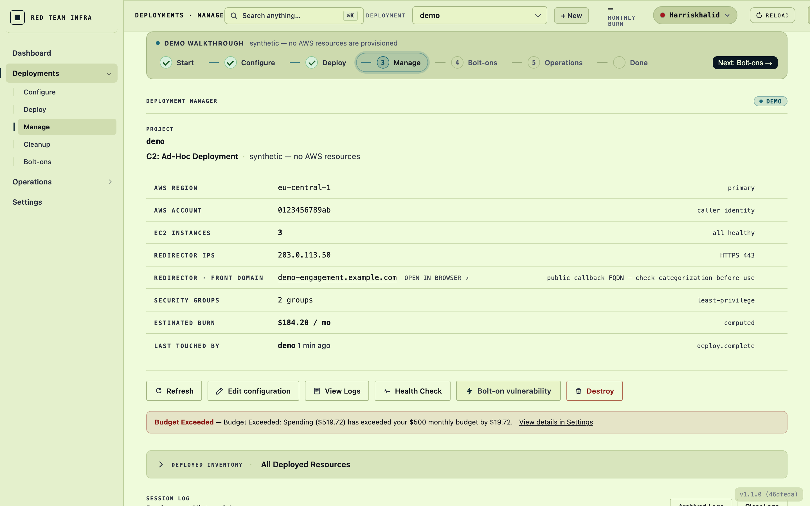

> [!CAUTION]
> **Migration in progress** — the move to the centralised AWS Dashboard Server is still ongoing. Some areas of the codebase and documentation may not yet fully reflect the dashboard-first architecture.

<div align="center">

# Red Team Infra

### Deploy and operate red-team infrastructure on AWS — entirely from your browser.

A full-stack, AWS-hosted platform that turns disposable, OPSEC-sound red-team infrastructure into a few clicks: modular Terraform + Ansible underneath, a Flask control plane on top, and Cobalt Strike, GOAD, and CREST exam-mirror labs wired in.

<br/>


</div>

---

## Table of Contents

- [Overview](#overview)
- [Architecture](#architecture)
- [Screenshots](#screenshots)
- [Key Features](#key-features)
- [Tech Stack](#tech-stack)
- [Deployment Types](#deployment-types)
- [Getting Started](#getting-started)
- [Documentation](#documentation)
- [Security & Authorized Use](#security--authorized-use)
- [License](#license)

---

## Overview

Standing up red-team infrastructure by hand is slow, repetitive, and easy to get wrong — and getting it *wrong* on operational security (exposed C2 servers, leaked IPs, sloppy access paths) can compromise an entire engagement. **Red Team Infra** removes that friction.

It is a single control plane for the whole lifecycle: provision a dedicated AWS **Dashboard Server** once, then configure, deploy, operate, and tear down command-and-control estates, redirectors, and vulnerable Active Directory labs from a browser. Everything is codified in modular Terraform and Ansible, so deployments are repeatable, reviewable, and disposable — and the operator's laptop never needs more than an SSH key and a browser tab.

---

## Architecture



*The full picture: the operator's single SSH entry point, the Dashboard Server control plane and the ten AWS services it orchestrates, and the C2 / GOAD / CCRTS estates — each in its own VPC, peered back to the dashboard, with the C2 beacon-callback path in red. Click to enlarge.*

The platform follows a **hub-and-spoke** model. The **Dashboard Server** — a dedicated EC2 instance in its own VPC (`10.100.0.0/16`) with a public Elastic IP, locked to an IP allow-list and SSH key — is both the production control plane and the *sole* SSH/RDP jump host. Every deployment (C2, GOAD, CCRTS) is created in its own VPC and **peered back to the Dashboard Server**, which then reaches every instance directly. There is no per-deployment bastion: the operator's laptop only ever tunnels to one place.

```
Operator laptop  ──(SSH key + IP allow-list)──▶  Dashboard Server (AWS, public EIP)
                                                       │  VPC peering
                          ┌────────────────────────────┼────────────────────────────┐
                          ▼                            ▼                            ▼
                    C2 VPC (10.0.0.0/16)        GOAD VPC (192.168.56.0/24)    CCRTS VPC (optional)
                  team servers · redirectors      vulnerable AD lab          Kali · Win · AD · ELK
```

---

## Screenshots

> The UI ships a built-in **demo mode** (synthetic data, no AWS resources) — the captures below are taken in that mode so the interface is shown without exposing live infrastructure.

| | |
|---|---|
|  |  |
| **Infrastructure Overview** — live deployments, active beacons, per-project cost trend, and budget alerts at a glance. | **Beacon Topology** — interactive graph with the team server at the hub; each callback branches out, with link types and admin beacons marked. |
|  |  |
| **Configure & Deploy** — a guided, validated config flow with live cost estimates, plan/validate/apply, and prerequisite uploads. | **Deployment Manager** — inspect deployed inventory, run health checks, bolt on vulnerabilities, view streaming logs, and destroy. |

---

## Key Features

- **Infrastructure as Code** — modular Terraform (one module per component) + Ansible provisioning; every deployment is repeatable, reviewable, and disposable.
- **Browser control plane** — a Flask + vanilla-JS dashboard runs on the AWS Dashboard Server (systemd); configure, deploy, operate, and destroy without touching the CLI.
- **C2 automation** — Cobalt Strike team servers, redirectors, in-browser beacon management over the CS REST API, a quick payload generator, and optional CloudFront domain fronting.
- **Live topology graph** — full-screen, interactive infrastructure/beacon map with subnet clustering, draggable nodes, config-driven port labels, and a detail side panel.
- **In-browser terminal** — multi-tab SSH into any deployed instance, plus tunnel shortcuts for RDP, the CS client, and the REST API — no manual key hopping.
- **Training labs** — GOAD (Game of Active Directory) variants and a self-contained CCRTS (CREST exam-mirror) lab with AD + an ELK stack for detection-rule iteration.
- **Single-jump access model** — one SSH tunnel to the Dashboard Server reaches everything via VPC peering; no per-deployment bastion, no static AWS keys on operator laptops.
- **Cost tracking & budgets** — per-project AWS cost monitoring with budget alerts surfaced directly in the dashboard.
- **Detection-rule mapping** — MITRE-mapped Elastic SIEM rules correlated to Cobalt Strike commands, updatable in one click.
- **Host setup checks** — SSM-based validation that bootstrap scripts ran correctly across every instance.

---

## Tech Stack

| Layer | Technology |
|---|---|
| **Infrastructure** | Terraform (HCL) `>= 1.0`, modular |
| **Config management** | Ansible `>= 2.9` |
| **Control plane / UI** | Python · Flask `3.0+`, vanilla JavaScript SPA |
| **Cloud** | AWS — EC2, VPC, S3, Route 53, ACM, IAM, Secrets Manager, CloudWatch, SSM *(region pinned `eu-central-1`)* |
| **C2** | Cobalt Strike (REST API automation) |
| **Training labs** | GOAD (Game of Active Directory), CREST Community AMIs (CCRTS) |
| **Scripting** | Bash (POSIX-compatible) |

---

## Deployment Types

A single `deployment_type` variable drives every architecture decision. **12 types** across 4 categories:

| Category | Types | What you get |
|---|---|---|
| **C2-Only** | `c2-adhoc` · `c2-purple` · `c2-full` | 1 / 2 / 3 team servers (single, redundant, or phase-based) |
| **GOAD-Only** | `goad-mini` · `goad-light` · `goad-sccm` · `goad-full` · `goad-nha` | Standalone vulnerable Active Directory labs |
| **CCRTS** | `ccrts` | Self-contained CREST exam-mirror lab (Kali + Windows + AD + ELK) |
| **Combined** | `combined-adhoc-mini` · `combined-adhoc-light` · `combined-full-full` | C2 + GOAD wired together via VPC peering |

See **[Deployment Modes](./docs/DEPLOYMENT_MODES.md)** for C2 sizing and **[GOAD Quick Start](./docs/GOAD_QUICK_START.md)** / **[CCRTS-Lab Operator Guide](./docs/CCRTS_LAB.md)** for the labs.

---

## Getting Started

Production runs on the **AWS Dashboard Server**. You provision it once from your laptop with a single interactive script; after that, operators only need an SSH key and a browser.

```bash
# 1 — Clone and provision the Dashboard Server (interactive)
git clone https://github.com/harr-sudo/Red_Team_Infra.git
cd Red_Team_Infra
./scripts/server/setup-dashboard.sh

# 2 — Tunnel in (the script prints this exact command on completion)
ssh -L 5000:localhost:5000 <operator>@<dashboard-eip>

# 3 — Open the dashboard, then configure & deploy from the browser
#     http://localhost:5000
```

`setup-dashboard.sh` writes `configs/dashboard.tfvars` from your answers, `terraform apply`s a new Dashboard Server (own VPC, public EIP, IP-locked, IAM instance role), syncs the code, and registers a systemd service so the app runs persistently.

> **Local CLI is dev-only.** You *can* run the dashboard on your laptop or deploy straight from `./scripts/deployment/deploy.sh`, but real engagements run on the AWS Dashboard Server.

**Full walkthrough → [docs/GETTING_STARTED.md](./docs/GETTING_STARTED.md)** (prompt-by-prompt setup, second-operator onboarding, verification, and troubleshooting).

---

## Documentation

<details open>
<summary><strong>Essential guides</strong></summary>

- **[Getting Started Guide](./docs/GETTING_STARTED.md)** — complete step-by-step setup for new operators
- **[Web Application Guide](./webapp/README.md)** — the browser control plane
- **[Centralized Dashboard Design](./docs/CENTRALIZED_DASHBOARD_DESIGN.md)** — full Dashboard Server architecture
- **[Dashboard Server Jump Host Guide](./docs/BASTION_JUMPBOX.md)** — the single-jump access model
- **[Access Methods](./docs/ACCESS_METHODS.md)** — every way to reach deployed instances
- **[AWS Authentication](./docs/AWS_AUTHENTICATION.md)** — how deployment authenticates to AWS

</details>

<details>
<summary><strong>Prerequisites</strong></summary>

- **[Domain Requirements](./docs/DOMAIN_REQUIREMENTS.md)** — domain registration & DNS
- **[Cobalt Strike Deployment](./docs/COBALT_STRIKE_DEPLOYMENT.md)** — CS archive upload & automation
- **[Tools Repository Quick Start](./docs/TOOLS_REPOSITORY_QUICK_START.md)** — optional tooling auto-deploy

</details>

<details>
<summary><strong>Labs & reference</strong></summary>

- **[GOAD Quick Start](./docs/GOAD_QUICK_START.md)** — deploy vulnerable AD labs
- **[CCRTS-Lab Operator Guide](./docs/CCRTS_LAB.md)** — CREST exam-mirror lab (AMIs + AD + ELK)
- **[Deployment Modes](./docs/DEPLOYMENT_MODES.md)** — C2 sizing (adhoc / purple / full)
- **[Quick Reference](./docs/QUICK_REFERENCE.md)** — commands & checklists
- **[Ansible SSH Key Distribution](./docs/ANSIBLE_SSH_KEYS.md)** — automated key distribution
- **[Tools Repository Setup](./docs/TOOLS_REPOSITORY_SETUP.md)** · **[Access](./docs/TOOLS_REPOSITORY_ACCESS.md)** — tools repo & multi-user access
- **[SSL Configuration](./docs/SSL_CONFIGURATION.md)** — TLS / certificates for redirectors
- **[High-Level Plan](./PLAN.md)** — comprehensive project plan & architecture

</details>

<details>
<summary><strong>Legacy / internal (historical design notes)</strong></summary>

Archived design and planning documents, kept for history — not part of the supported onboarding path.

- [GOAD Integration Plan](./docs/legacy/internal/GOAD_INTEGRATION_PLAN.md)
- [Deployment Guide (legacy)](./docs/legacy/internal/deployment-guide.md)
- [Scripting Guide (legacy)](./docs/legacy/internal/scripting-guide.md)
- [GitHub Setup (legacy)](./docs/legacy/internal/GITHUB_SETUP.md)

</details>

---

## Security & Authorized Use

> This platform automates offensive-security tooling and is intended **only for lawful, authorized red-team engagements and training**. Ensure you have explicit permission before deploying.

- **Single SSH entry point** — the Dashboard Server, gated by SSH key + IP allow-list.
- **Least-privilege IAM** — the Dashboard Server uses an IAM instance role; no static AWS keys live on operator laptops.
- **Secrets in AWS Secrets Manager** — team-server and host credentials are never committed to source.
- **Network isolation** — C2 servers live in private subnets and are never directly internet-facing; redirectors front all callbacks.
- **S3 confused-deputy protection** — 3-layer defense (trust policy + permission policy + bucket policy).

---

## License

**All Rights Reserved.** This repository is published publicly for portfolio review and evaluation viewing only — no use, copying, modification, or distribution is permitted without prior written consent. See **[LICENSE](./LICENSE)** for the full terms.
