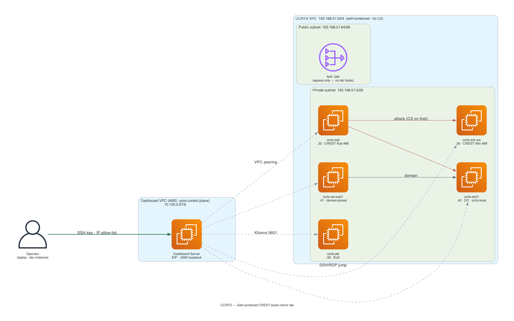

# CCRTS-Lab — CREST Certified Red Team Specialist Exam Mirror

## Overview

**CCRTS** (CREST Certified Red Team Specialist) is a UK-issued red team certification administered at Pearson VUE testing centres. The exam provides candidates with two locked-down workstations — a **Kali Linux** AMI and a **Windows** AMI — both customised and published by CREST. The **CCRTS-Lab** feature in this dashboard provisions an AWS-hosted environment that mirrors the exam estate so operators can rehearse against the same images, networking shape, and tooling layout they will see on test day.

It is exposed as a **single, fully self-contained deployment type — `ccrts`**. There are **no size tiers** (no mini/full split) and **no C2 integration** (no combined modes, no bolt-on-to-C2, no C2 VPC peering). The lab always provisions the same 5 hosts and lives entirely on its own in an isolated VPC.

The lab is built around the publicly available **CREST Community AMIs** (AWS account `126620636130`), augmented with a small **Active Directory** estate (DC + domain-joined workstation) and an **ELK** stack for detection rule development. It is deliberately self-contained — it does not consume the framework's shared C2 redirector infrastructure, and Cobalt Strike from the exam environment is **not** included in the downloadable AMIs (CS runs on the Kali host directly — bring your own licensed install).

This module mirrors the open-source [`spark42/ccrts-lab`](https://gitlab.com/spark42/ccrts-lab) project by Richard Mader, which is published as **a single modular lab configuration — not a multi-size offering**. Where Spark42 publishes a single-region Vagrant + Terraform recipe, this dashboard module:

- Pins all deployment to `eu-central-1` (the framework's standard region) via cross-region `aws_ami_copy`.
- Wraps the lab as a first-class, self-contained deployment type selectable from the dashboard UI.
- Manages CREST AMI version drift through the Cleanup pane.

### Why this lab exists

- **Rehearsal parity.** Candidates can practise with the exact CREST AMI builds rather than approximations.
- **Detection iteration.** The ELK stack ingests host telemetry so operators can refine OPSEC against Sigma/Elastic SIEM rules before sitting the exam.
- **Fully isolated networking.** Lab sits in its own `192.168.57.0/24` VPC chosen specifically to avoid collisions with the C2 VPC (`10.0.0.0/16`), GOAD VPC (`192.168.56.0/24`), and the optional test lab (`10.0.20.0/24`). There is no peering to a C2 deployment — the lab stands alone.

---

## Architecture



```
Operator laptop
   │  (browser + SSH client)
   │
   └── SSH tunnel ──▶ Dashboard EC2 (sole jump host)
                           │
                           │  VPC peering / cross-VPC routing
                           ▼
                 CCRTS VPC — 192.168.57.0/24  (fully isolated — no C2)
                 ┌────────────────────────────────────────────┐
                 │  Private subnet (192.168.57.0/26)          │
                 │   • ccrts-kali        192.168.57.20        │
                 │   • ccrts-win-ws      192.168.57.30        │
                 │   • ccrts-dc01        192.168.57.40        │
                 │   • ccrts-ad-ws01     192.168.57.41        │
                 │   • ccrts-elk         192.168.57.50        │
                 │                                            │
                 │  Public subnet  (192.168.57.64/26)         │
                 │   • NAT GW (egress only — no lab hosts)    │
                 └────────────────────────────────────────────┘
```

There is **no C2 VPC** and **no C2 peering** — the `ccrts` lab is a standalone environment reached only through the Dashboard Server jump.

### Host inventory

All 5 hosts are **always present** — `ccrts` has no size tiers, so there is no "mini" subset.

| Host | OS | Instance | IP | Role |
|---|---|---|---|---|
| **ccrts-kali** | Kali Linux (CREST AMI) | `t3.medium` | `192.168.57.20` | Attack platform — CREST Kali candidate image (CS runs here) |
| **ccrts-win-ws** | Windows (CREST AMI) | `t3.large` | `192.168.57.30` | CCRTS candidate workstation |
| **ccrts-dc01** | Windows Server 2022 | `t3.medium` | `192.168.57.40` | Domain controller for `ccrts.local` |
| **ccrts-ad-ws01** | Windows 11 | `t3.medium` | `192.168.57.41` | Domain-joined member workstation |
| **ccrts-elk** | Ubuntu 22.04 | `t3.large` | `192.168.57.50` | Elasticsearch + Kibana + Logstash 8.19 (single-node, no auth) |

### Network CIDRs

| Block | Purpose |
|---|---|
| `192.168.57.0/24`  | CCRTS VPC (full block) |
| `192.168.57.0/26`  | Private subnet — all lab hosts (.20 kali, .30 win-ws, .40 dc01, .41 ad-ws01, .50 elk) |
| `192.168.57.64/26` | Public subnet — NAT GW egress only, no lab hosts |

No bastion host is provisioned inside the CCRTS VPC. The **dashboard EC2 instance acts as the SSH jump** for every connection into the lab — see [Operator connection guide](#operator-connection-guide) below.

---

## Prerequisites

CCRTS-Lab has lighter prerequisites than the C2 deployment types:

| Requirement | Status |
|---|---|
| AWS account with EC2/VPC/IAM/EBS/CopyImage permissions | **Required** |
| CCRTS exam booking with CREST / Pearson VUE | **Not required** — Community AMIs are publicly accessible |
| Registered domain + Route 53 zone | **Not required** — lab has no public-facing services |
| Cobalt Strike archive uploaded to S3 | **Not required** — `ccrts` is self-contained and does not use the framework's C2 tooling |
| Cobalt Strike licence | **Recommended** for operators wanting parity with the Pearson VUE environment (the CS install is licensed inside the exam centre but **not** included in the downloadable AMI; bring your own) |

**Important:** CCRTS-Lab is intended for licensed red team operators preparing for, or training around, the CCRTS certification. The lab AMIs and AD estate are not hardened — see [Default credentials](#default-credentials) for the security posture.

---

## CREST AMI mechanism — how the cross-region copy works

**Does this provision anything in `eu-west-2` (or any other CREST source region)?**
**No.** The framework only **reads AMI metadata** from the source region and triggers AWS's `CopyImage` API to materialise a copy in `eu-central-1`. After the initial copy completes, the source region is never touched again.

### The flow

1. CREST publishes Community AMIs in `eu-west-2`, `us-east-1`, `ap-southeast-1`, and `ap-southeast-2`.
2. The owning account is **`126620636130`** (Amazon Web Services Marketplace partner ID for CREST).
3. The Terraform module uses an `aws_ami` data source filtered by name (e.g., `CREST RTS Kali Candidate Image *`) and owner `126620636130` in `eu-west-2` to discover the latest published version.
4. An `aws_ami_copy` resource then asks AWS to copy the AMI + underlying EBS snapshots into `eu-central-1` (the framework's standard region).
5. EC2 instances in the CCRTS VPC reference the **copied AMI ID** in `eu-central-1`. The source AMI in `eu-west-2` is **not** referenced by any compute resource we deploy.

### Terraform snippet

```hcl
# terraform/modules/ccrts_lab/main.tf

# Provider alias pinned to a CREST source region — used ONLY for metadata reads
provider "aws" {
  alias  = "crest_source"
  region = "eu-west-2"
}

# Discover the latest published Kali Candidate image (metadata read only)
data "aws_ami" "crest_kali_source" {
  provider    = aws.crest_source
  owners      = ["126620636130"]
  most_recent = true

  filter {
    name   = "name"
    values = ["CREST RTS Kali Candidate Image *"]
  }
}

# Copy into eu-central-1 (the only region where compute will run)
resource "aws_ami_copy" "ccrts_kali" {
  name              = "ccrts-kali-${data.aws_ami.crest_kali_source.name}"
  description       = "CCRTS Kali image copied from ${data.aws_ami.crest_kali_source.id} (eu-west-2)"
  source_ami_id     = data.aws_ami.crest_kali_source.id
  source_ami_region = "eu-west-2"

  tags = {
    Name             = "ccrts-kali"
    SourceAMIName    = data.aws_ami.crest_kali_source.name
    CRESTPublishedAt = data.aws_ami.crest_kali_source.creation_date
  }
}

# EC2 instance references the COPIED AMI in eu-central-1
resource "aws_instance" "ccrts_kali" {
  ami           = aws_ami_copy.ccrts_kali.id     # local to eu-central-1
  instance_type = "t3.medium"
  subnet_id     = aws_subnet.ccrts_private.id
  private_ip    = "192.168.57.20"
  # ...
}
```

### Timing & cost characteristics

- **First deploy is slow.** AMI copy is performed asynchronously by AWS — expect **20-30 minutes** for the Kali and Windows images to finish copying on first `terraform apply`. The EC2 instances cannot launch until the copy completes.
- **Subsequent deploys are no-ops.** The `aws_ami_copy` resource is keyed on the source AMI name. As long as CREST has not published a new image, the resource is stable and `terraform apply` is fast.
- **Storage overhead.** Each copied AMI keeps its underlying EBS snapshots in the operator's account: roughly **$5-10/month per image** in `eu-central-1` snapshot storage. The Kali and Windows images together typically sit at ~$15-20/month idle.
- **One-time data transfer.** Cross-region snapshot copy is billed at standard EBS snapshot cross-region transfer rates — usually under **$1 per AMI** depending on snapshot size.

See [Upgrading CREST AMIs](#upgrading-crest-amis) for what happens when CREST publishes a new version.

---

## Deployment type

CCRTS-Lab adds **one** deployment type to the framework, taking the total from 11 to 12:

| `deployment_type` | Hosts | Est. monthly | Use case |
|---|---|---|---|
| `ccrts` | 5 (kali, win-ws, dc01, ad-ws01, elk) + NAT | **~$310/mo** | Self-contained CREST exam mirror — Kali + Windows + AD estate + ELK |

The `ccrts` deployment is **fully self-contained** — it includes its own VPC, NAT gateway, IAM roles, and security groups, and provisions all 5 hosts every time. It is reached **only** through the Dashboard Server (the sole SSH jump) via VPC peering between the Dashboard VPC and the CCRTS VPC. There is no C2 VPC and no C2 peering: matching upstream `spark42/ccrts-lab`, the lab stands alone with no size tiers, no combined modes, and no bolt-on-to-C2 path.

---

## Configuration

All CCRTS variables live in `terraform/variables.tf` and can be set in `configs/terraform.tfvars`.

| Variable | Default | Description |
|---|---|---|
| `deployment_type` | `c2-adhoc` | Set to `ccrts` for the self-contained exam-mirror lab |
| `ccrts_vpc_cidr` | `192.168.57.0/24` | CCRTS VPC CIDR — change only if conflicting with another VPC |
| `ccrts_kali_instance_type` | `t3.medium` | Override Kali workstation sizing |
| `ccrts_win_instance_type` | `t3.large` | Override Windows workstation sizing |
| `ccrts_dc_instance_type` | `t3.medium` | Override DC sizing |
| `ccrts_ad_ws_instance_type` | `t3.medium` | Override AD member workstation sizing |
| `ccrts_elk_instance_type` | `t3.large` | Override ELK node sizing |
| `ccrts_ad_domain` | `ccrts.local` | AD domain FQDN |
| `ccrts_ad_netbios` | `CCRTS` | NetBIOS short name |
| `ccrts_ad_admin_password` | `P@ssw0rd1!` | Domain administrator password — change for long-lived deployments |
| `ccrts_ad_user_password` | `Welcome1!` | Low-priv `jdoe` user password |
| `ccrts_management_cidr_blocks` | `[]` | Optional direct-access CIDRs (not normally needed — dashboard is the jump host) |
| `ccrts_source_region` | `eu-west-2` | CREST AMI source region for the cross-region copy |

> **Note:** `ccrts_ad_admin_password` and `ccrts_ad_user_password` are `sensitive = true`. They are written to AWS Secrets Manager under `/<project>/<env>/ccrts/ad-credentials` and never echoed in Terraform output.

---

## Operator connection guide

The CCRTS VPC has **no public-facing instances** — every connection must traverse the dashboard EC2 as an SSH jump. Replace `<dashboard-eip>` with your dashboard's Elastic IP (visible on the Server tab of the dashboard UI).

### Kali workstation (SSH)

```bash
# Tunnel SSH from local 2222 to the Kali host inside the CCRTS VPC
ssh -L 2222:192.168.57.20:22 ubuntu@<dashboard-eip>

# In a second terminal, connect to the tunnel
ssh -p 2222 kali@localhost
```

### Windows workstation (RDP)

```bash
# Tunnel RDP from local 13389 to the Windows candidate workstation
ssh -L 13389:192.168.57.30:3389 ubuntu@<dashboard-eip>

# Then point your RDP client at:  localhost:13389
# Credentials: Administrator / password (CREST AMI default)
```

### Kibana (ELK)

```bash
# Tunnel Kibana's web UI
ssh -L 5601:192.168.57.50:5601 ubuntu@<dashboard-eip>

# Browse to:  http://localhost:5601
# Single-node, no auth (lab-only posture)
```

### WinRM to the DC (detection rule testing)

```bash
# Tunnel WinRM for tools that consume the management plane (e.g., evil-winrm, NetExec)
ssh -L 5985:192.168.57.40:5985 ubuntu@<dashboard-eip>

# Tool can now target localhost:5985 with CCRTS\Administrator / P@ssw0rd1!
```

> The dashboard's **Manage** pane surfaces these tunnel commands as copy-buttons against each provisioned host. You should not need to type them by hand once the deployment is live.

---

## Default credentials

The lab uses the credentials below intentionally — they match the published CREST AMI defaults and a deliberately weak AD posture. **Do not leave a CCRTS-Lab running unattended on a public AWS account** — rotate the AD passwords or destroy the lab when not in active use.

| Host / scope | Username | Password |
|---|---|---|
| Kali (`ccrts-kali`) | `kali` | `kali` |
| Windows workstation (`ccrts-win-ws`) | `Administrator` | `password` |
| AD domain admin (`ccrts.local`, NetBIOS `CCRTS`) | `CCRTS\Administrator` | `P@ssw0rd1!` |
| AD low-priv user | `CCRTS\jdoe` | `Welcome1!` |
| ELK (`ccrts-elk`) | _no auth_ | _no auth_ |

> **Security warning:** The CREST AMI defaults are public knowledge. Any internet-facing exposure of these hosts will be trivially compromised. The framework keeps every host in private subnets behind the dashboard jump host — do not punch holes in the security groups for "convenience" SSH/RDP.

---

## What's NOT included

- **Cobalt Strike.** Per Spark42's blog and confirmed by CREST documentation, the CS install on the exam Kali AMI is **licensed only inside Pearson VUE's network** and is **not part of the downloadable Community AMI**. Operators wanting CS in the lab must bring their own licensed install and deploy it onto the Kali host manually.
- **Bolt-ons (Sliver, Mythic, etc.).** The `ccrts` deployment does not support the Bolt-ons sub-pill on the dashboard. The lab is a self-contained exam mirror and CS runs on the Kali workstation itself — the shared C2 bolt-on tooling does not apply. The bolt-ons pill is rendered **disabled** with an inline explainer.
- **Operations pane.** The `ccrts` deployment does not integrate with the dashboard's Operations sub-pill (beacon catalogue, listener management, PE Payload Generator). CS lives on the Kali host directly and is operated through the CS client there. The Operations pill is rendered **disabled** with an inline explainer.
- **C2 integration.** There are no combined modes, no bolt-on-to-C2 flag, and no C2 VPC peering. `ccrts` is a standalone lab — it never shares a deployment with C2 infrastructure.
- **Domain fronting / CloudFront.** Lab traffic does not traverse the framework's redirector + fronting infrastructure.
- **Route 53 / ACM.** No public DNS or certificates are provisioned — the lab is private-only.

The disabled Bolt-ons + Operations pills are intrinsic to `ccrts` — there is no combined variant that re-enables them, because the C2 side is never present.

---

## Cost breakdown

Monthly figures assume `eu-central-1` on-demand pricing and 24x7 uptime. Stopping instances when not in use reduces compute cost to ~$0 (EBS-only). The AMI snapshot storage overhead persists across stop/start cycles.

| Component | Cost | Notes |
|---|---|---|
| Kali workstation (`t3.medium`) | $30 | |
| Windows workstation (`t3.large`) | $66 | Windows licensing premium |
| Domain controller (`t3.medium`) | $30 | |
| AD member workstation (`t3.medium`) | $30 | |
| ELK (`t3.large`) | $66 | |
| NAT Gateway | $32 | Per-hour + data |
| EBS volumes (~50 GB × hosts) | $20 | |
| **CREST AMI snapshot storage** | $15-20 | One-time copy, persists in `eu-central-1` |
| **Total** | **~$310/mo** | |

> **The AMI snapshot line item is the only cost that is non-obvious.** Even with all instances destroyed, the copied AMIs and their snapshots continue to cost ~$15-20/month until manually deleted via the Cleanup pane.

---

## Cleanup

```bash
# Standard tear-down — destroys VPC, instances, IAM, security groups
terraform destroy -var-file=../configs/terraform.tfvars
```

`terraform destroy` removes the EC2 instances, VPC, route tables, NAT gateway, IAM roles, security groups, and the `aws_ami_copy` resources (which deregisters the copied AMIs).

**However**, deregistering an AMI does **not** automatically delete the underlying EBS snapshots in older Terraform AWS provider versions. The dashboard provides an **Orphan AMI Cleanup pane** that:

1. Lists all snapshots in `eu-central-1` whose description references a deregistered CCRTS AMI.
2. Lets the operator one-click delete them.
3. Reports the storage reclaimed (typically 15-30 GiB per orphaned AMI).

Run this after every `terraform destroy` cycle if you do not plan to redeploy soon. It also runs automatically when the operator selects "Full cleanup" from the Manage pane.

---

## Upgrading CREST AMIs

CREST publishes new versions of the Kali and Windows candidate images periodically (typically every 6-12 months as the underlying Kali / Windows base images receive security updates).

### What happens on re-apply

1. The `aws_ami` data source is filtered with `most_recent = true` — it always picks up the newest published version.
2. The `aws_ami_copy.ccrts_kali` resource is keyed on the source AMI name (e.g., `ccrts-kali-CREST RTS Kali Candidate Image 2024-11-14 1.0` vs `ccrts-kali-CREST RTS Kali Candidate Image 2025-04-01 1.1`). A new source name triggers Terraform to plan a **replacement** copy.
3. `terraform apply` triggers a fresh `aws_ami_copy` (another 20-30 minute wait) and re-launches the affected instances with the new AMI.
4. The **previously copied AMI** is deregistered. Its underlying snapshots become orphans — sweep them with the Cleanup pane.

### Pinning a specific version

If you need to keep an old AMI version (e.g., to reproduce a specific exam estate), override the data source filter to match a specific name string rather than `most_recent`:

```hcl
data "aws_ami" "crest_kali_source" {
  provider = aws.crest_source
  owners   = ["126620636130"]

  filter {
    name   = "name"
    values = ["CREST RTS Kali Candidate Image 2024-11-14 1.0"]
  }
}
```

---

## Troubleshooting

### `CopyImage` fails with `UnauthorizedOperation`

The IAM role or user running Terraform needs `ec2:CopyImage`, `ec2:DescribeImages`, `ec2:CreateTags`, and `ec2:DeregisterImage`. If you're running with the dashboard's deployment role, ensure the policy attached to `dashboard-deployment-role` includes these actions. The framework's default deployment role policy includes them — if you've custom-scoped permissions, audit them now.

### AMI copy stuck `pending` for over an hour

Cross-region AMI copies are usually 20-30 minutes. If a copy stays `pending` beyond 60 minutes:

1. Check AWS Service Health Dashboard for EBS / EC2 issues in `eu-central-1` and the source region.
2. Verify the source AMI is still public (CREST occasionally deprecates older versions).
3. As a last resort, `terraform taint aws_ami_copy.ccrts_kali` and re-apply to start a fresh copy.

### `Snapshot count exceeded` during copy

Each AMI copy creates new EBS snapshots in the operator's account. The default per-region snapshot quota is 100,000 — unlikely to hit, but the per-snapshot rate quota (`SnapshotCreatePerRequest`) can be exceeded if many copies run concurrently. Request a quota increase via AWS Service Quotas if you're operating a large fleet of CCRTS labs.

### Kali / Windows instance won't launch after AMI copy completes

Check the EC2 console — the most common cause is the copied AMI being in a `pending` state when Terraform tries to launch. The `aws_ami_copy` resource waits for `available` before reporting success, but if you manually rolled back a failed apply, the instance may have referenced an AMI ID that no longer exists. Run `terraform apply` again.

### `ccrts-elk` returns HTTP 503 from Kibana

ELK on a single-node `t3.large` takes ~5 minutes to finish bootstrapping after the instance is up. The systemd unit logs (`journalctl -u elasticsearch`, `journalctl -u kibana`) will show progress. If Kibana stays 503 beyond 10 minutes, check available RAM — the JVM heap defaults assume `t3.large` headroom.

### Domain controller unreachable on `192.168.57.40`

The DC takes the longest to provision (~15 minutes) because it has to promote itself and reboot. Wait, then check via the dashboard's Manage pane health check. If still unreachable, SSM-session into the host (`aws ssm start-session --target <instance-id> --region eu-central-1`) and inspect the bootstrap log at `C:\ProgramData\setup-status.json`.

---

## References

- **Spark42 inspiration:** [`gitlab.com/spark42/ccrts-lab`](https://gitlab.com/spark42/ccrts-lab) (MIT, by Richard Mader)
- **CREST Kali AMI setup guide:** [PDF — CREST-RTS-Kali-Candidate-Machine-AMI-Setup-Guide.pdf](https://www.crest-approved.org/wp-content/uploads/2024/12/CREST-RTS-Kali-Candidate-Machine-AMI-Setup-Guide.pdf)
- **CREST Windows AMI setup guide:** Published alongside the Kali guide on the CREST resources page
- **CCRTS certification:** [crest-approved.org](https://www.crest-approved.org/) — search "CCRTS"
- **CREST Community AMIs (AWS account `126620636130`):** Listed in the EC2 console under Community AMIs in `eu-west-2`, `us-east-1`, `ap-southeast-1`, `ap-southeast-2`
- **Internal modules:**
  - `terraform/modules/ccrts_lab/main.tf` — module orchestration
  - `terraform/modules/vpc_peering/main.tf` — Dashboard VPC ↔ CCRTS VPC peering (the operator jump path)
  - `webapp/backend/routes/ccrts.py` — dashboard backend routes
  - `webapp/frontend/js/app.js` — UX gating for disabled bolt-ons + operations pills
