# Architecture Diagrams Quick Reference

## All Generated Diagrams

This page provides a visual index of all architecture diagrams generated for the Red Team Infrastructure project.

> **Access model:** across every diagram below, the operator's entry point is the AWS-hosted **Dashboard Server** (its own VPC, peered with each deployment VPC) acting as the production control plane and sole SSH jump host. There is no per-deployment SSH-relay bastion. The GOAD jumpbox shown in some diagrams is the AD-lab Ansible provisioning host (reached *through* the dashboard) — not an access path. The operator's laptop runs only a *dev* instance of the dashboard. See [README — Dashboard Server](./README.md#dashboard-server-production-control-plane).

---

## GOAD Training Labs

### GOAD Mini - Single DC Training Lab (1 DC)
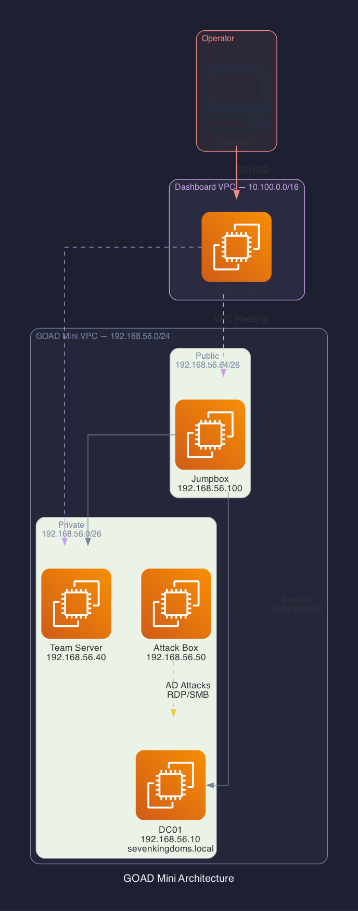
**Cost**: $75-100/month | **VMs**: 1 DC | **Domain**: sevenkingdoms.local | **IPs**: .10 (DC), .40 (TS), .50 (AB), .100 (JB)
[📖 Full Documentation](./goad-mini.md)

---

### GOAD Light - Multi-Domain Lab (2 DCs + 1 Server)
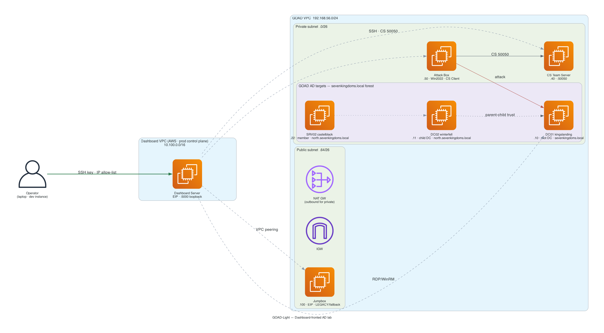
**Cost**: $150-200/month | **VMs**: 3 (2 DC + 1 SRV) | **Domains**: sevenkingdoms.local + north.sevenkingdoms.local | **Parent-Child Trust**
[📖 Full Documentation](./goad-light.md)

---

### GOAD SCCM - Configuration Manager Lab (DC + srv01 + srv02 + ws01)
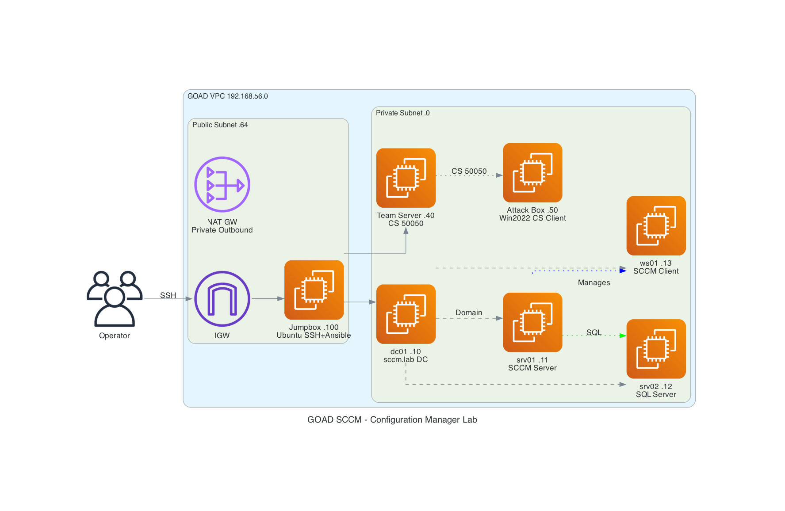
**Cost**: $180-230/month | **VMs**: 4 (dc01 + srv01/SCCM + srv02/SQL + ws01/Client) | **Domain**: sccm.lab | **IPs**: .10, .11, .12, .13

---

### GOAD Full - Complete AD Environment (3 DCs + 2 Servers)
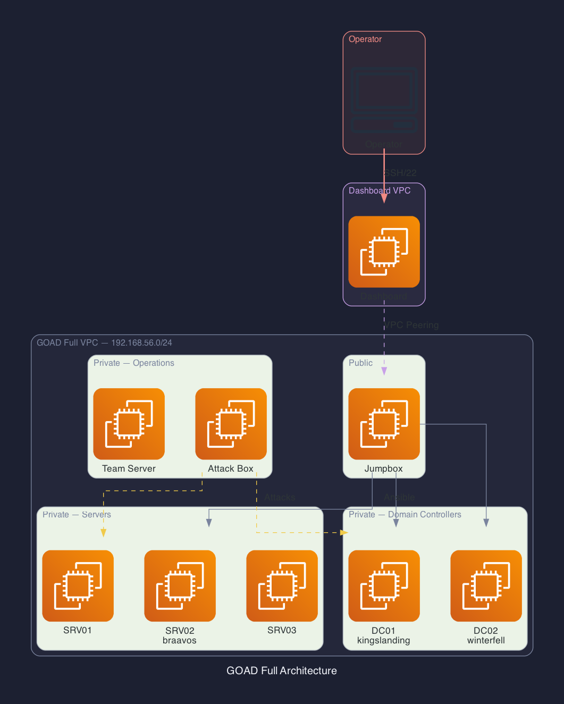
**Cost**: $200-250/month | **VMs**: 5 (3 DC + 2 SRV) | **Forests**: sevenkingdoms.local + essos.local | **Forest + Parent-Child Trusts**
[📖 Full Documentation](./goad-full.md)

---

### GOAD NHA - Network Hacking Academy (dc01 + dc02 + srv01-srv03)
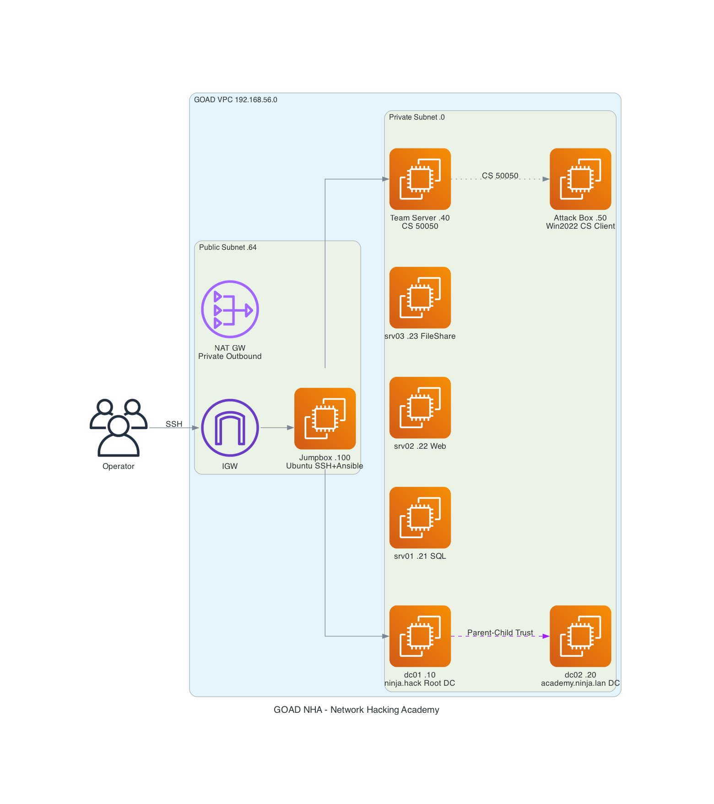
**Cost**: $200-250/month | **VMs**: 5 (dc01 + dc02 + srv01 + srv02 + srv03) | **Domains**: ninja.hack + academy.ninja.lan | **IPs**: .10, .20-.23

---

## C2 Infrastructure

### C2 Ad-Hoc - Single Team Server (Standard)
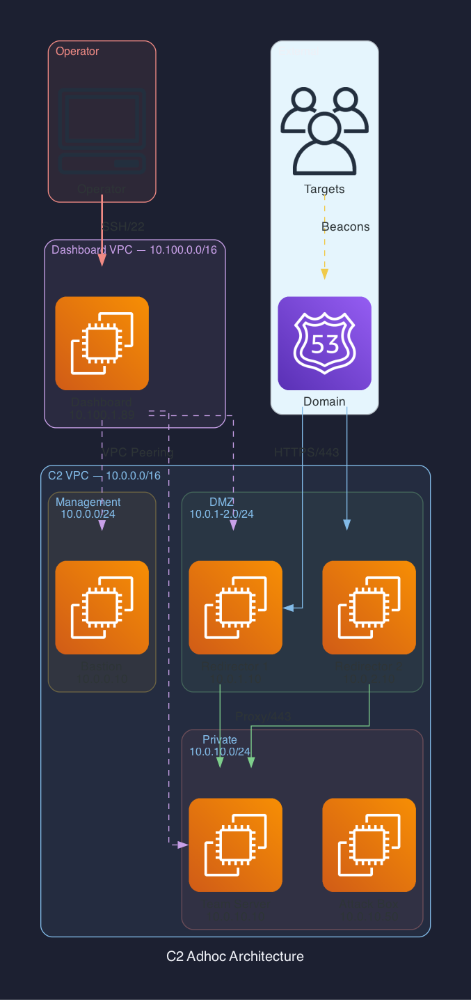
**Cost**: $160-192/month | **C2 Servers**: 1 | **Redirectors**: 2 | **Attack Box**: 1 | **SSL**: Let's Encrypt or Self-Signed
[📖 Full Documentation](./c2-adhoc.md)

---

### C2 Ad-Hoc - Domain Fronting Mode (Optional)
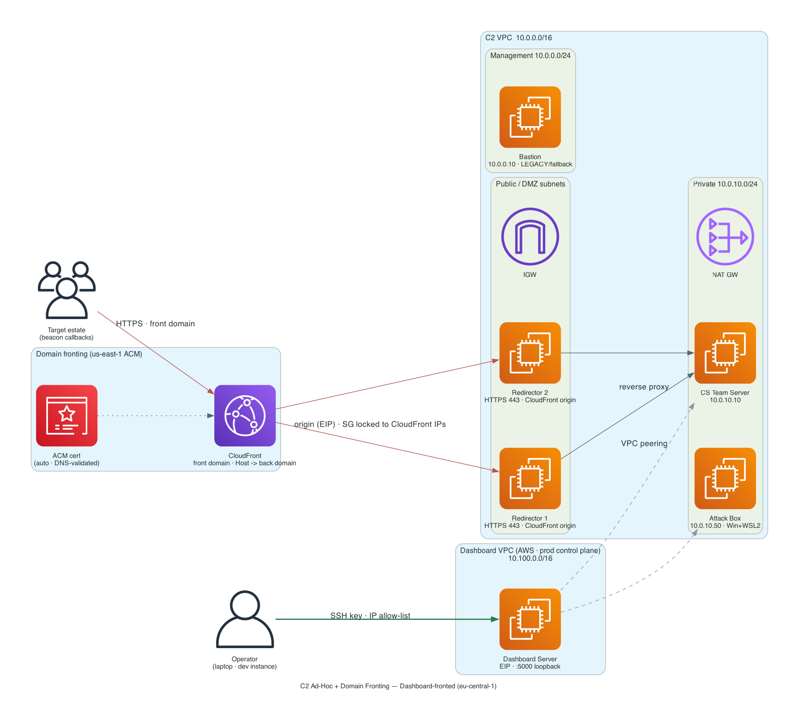
**Cost**: +$10-50/month | **CloudFront**: Hides redirector IPs | **SSL**: ACM (auto, free)
[📖 Full Documentation](./c2-adhoc.md#ssltls-options)

---

### C2 Purple Team - Redundant Servers
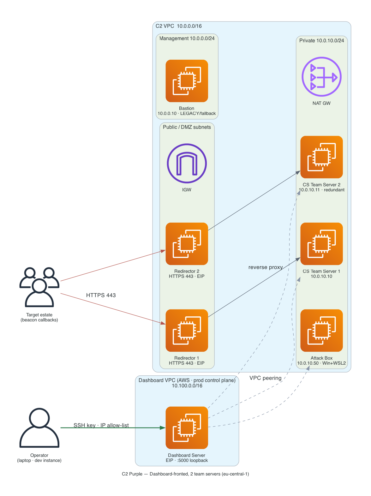
**Cost**: $190-230/month | **C2 Servers**: 2 | **Attack Box**: 1 | **High Availability**: ✅
[📖 Full Documentation](./c2-adhoc.md)

---

### C2 Full Red Team - Phase-Based Operations
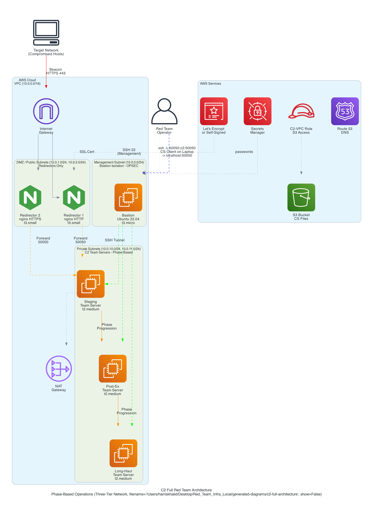
**Cost**: $220-260/month | **C2 Servers**: 3 (Phases) | **Attack Box**: 1 | **Advanced OpSec**: ✅
[📖 Full Documentation](./c2-adhoc.md)

---

## Combined Deployments

### Combined: C2 + GOAD Mini

**Cost**: $180-220/month | **VPC Peering**: ✅
[📖 Full Documentation](./goad-mini.md)

---

### Combined: Full C2 + GOAD Light
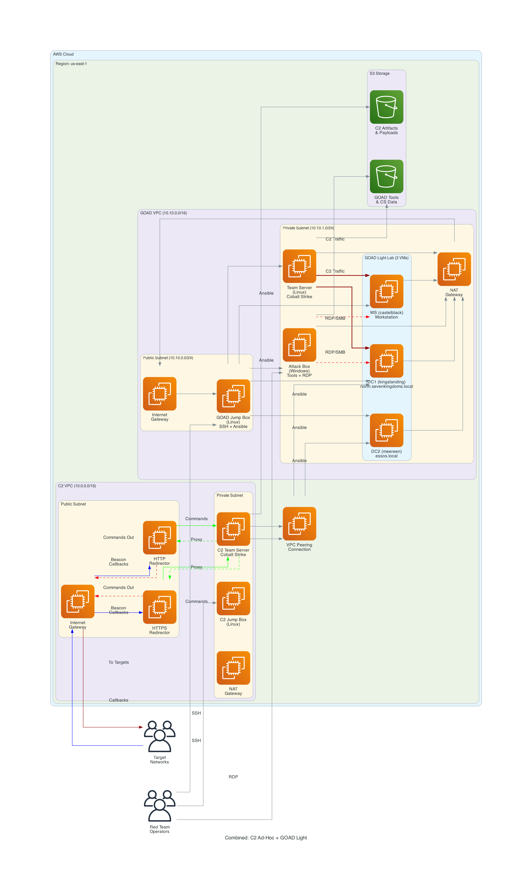
**Cost**: $350-420/month | **Complete Training Environment**: ✅
[📖 Full Documentation](./goad-light.md)

---

## CCRTS-Lab (CREST Exam Mirror)

### CCRTS — Self-contained CREST exam-mirror lab

**Cost**: ~$310/month | **Hosts**: 5 (ccrts-kali, ccrts-win-ws, ccrts-dc01, ccrts-ad-ws01, ccrts-elk) + NAT | **VPC**: 192.168.57.0/24 (fully isolated — no C2) | **AD Domain**: ccrts.local
[📖 Full Documentation](../CCRTS_LAB.md)

---

## Bolt-on Test Lab

### Test Lab — bolt-on subnet inside the C2 VPC
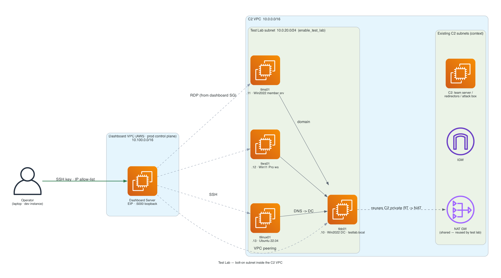
**Enabled by**: `enable_test_lab = true` on a `c2-*` deployment | **Hosts**: 4 (tldc01, tlms01, tlws01, tllinux01) | **Subnet**: 10.0.20.0/24 inside the C2 VPC (no new VPC/NAT — reuses the C2 NAT GW) | **AD Domain**: testlab.local
[📖 Test Lab Design](../legacy/internal/TESTLAB_DESIGN.md)

---

## Component Architectures

### Windows Attack Box - Standalone Module Architecture

**Features**: Windows Server 2022 + WSL2, CS Client, Tools Repository, RDP Access | **11 C2 / GOAD / combined types** (the self-contained `ccrts` lab uses its CREST Kali host instead)
[📖 Full Documentation](./attackbox.md)

---

### IAM Security - Separate Roles Per VPC

**Security**: Least Privilege, Separate Roles, Permission Boundaries
[📖 Full Documentation](./README.md)

---

### SSH Key Management Architecture

**Automation**: Ansible Distribution, Secure Storage, Access Control
[📖 Full Documentation](./ssh-key-management.md)

---

### SSL/TLS Options Comparison
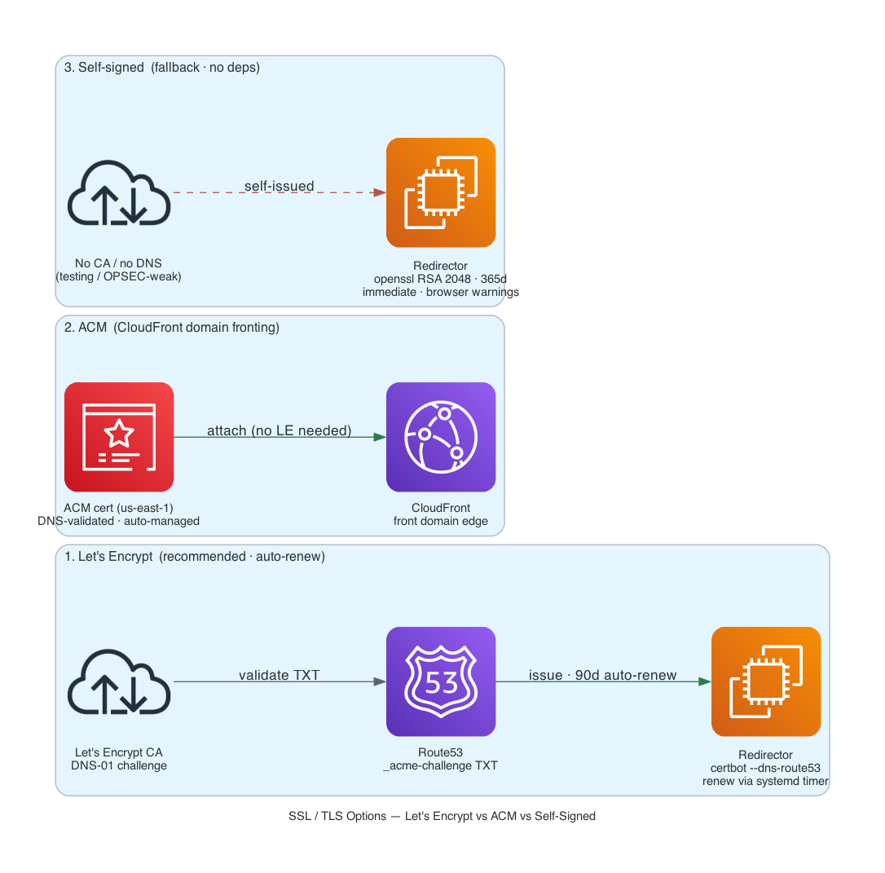
**Options**: Let's Encrypt (standard), Domain Fronting + ACM (advanced), Self-Signed (testing only)
[📖 Full Documentation](./c2-adhoc.md#ssltls-options)

---

## Diagram Generation

All diagrams were generated using:
- **AWS Diagram MCP Server** - Official AWS tool
- **AWS Best Practices** - Following [this guide](https://aws.amazon.com/blogs/machine-learning/build-aws-architecture-diagrams-using-amazon-q-cli-and-mcp/)
- **GraphViz** - Professional diagram rendering
- **AWS Official Icons** - Latest icon set

---

## Quick Navigation

- [📚 Documentation Index](./README.md)
- [💰 Cost Comparison](./README.md#cost-comparison-matrix)
- [🎯 Decision Matrix](./README.md#decision-matrix)
- [🔧 Troubleshooting](./README.md#support--troubleshooting)

---

**Last Updated**: February 2026
