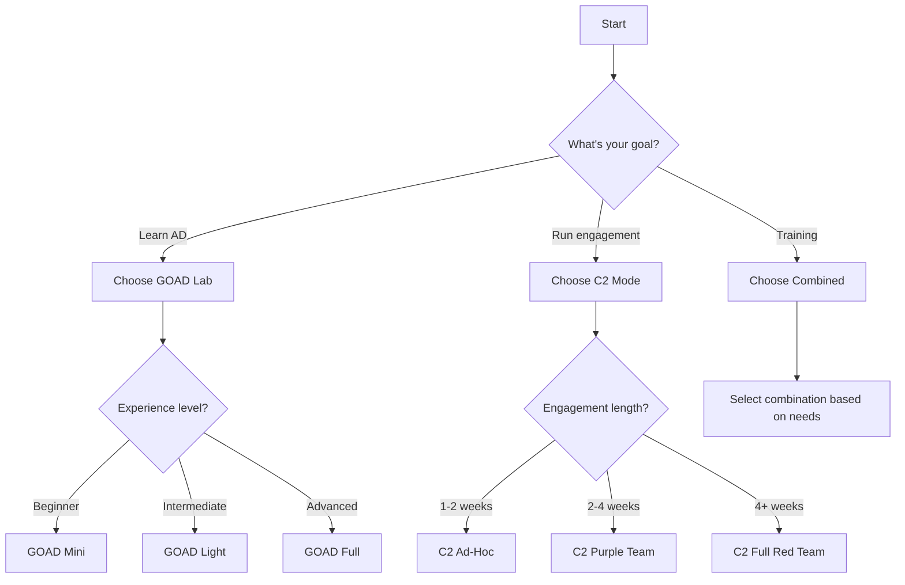

# Architecture Documentation Index

## Overview

This directory contains detailed architecture documentation for all deployment modes supported by the Red Team Infrastructure project. Each document includes diagrams, configurations, cost breakdowns, and operational guidance.

## Quick Navigation

### GOAD Training Labs

| Lab Type | VMs | Domains | Cost/Month | Best For | Documentation |
|----------|-----|---------|------------|----------|---------------|
| **GOAD Mini** | 2 | 1 | $75-100 | Beginners, learning AD basics | [📄 goad-mini.md](./goad-mini.md) |
| **GOAD Light** | 4 | 2 | $200-250 | Intermediate, multi-domain attacks | [📄 goad-light.md](./goad-light.md) |
| **GOAD Full** | 6 | 3 | $350-400 | Advanced, complete AD environment | [📄 goad-full.md](./goad-full.md) |

### C2 Infrastructure

| Deployment Mode | Servers | Cost/Month | Best For | Documentation |
|----------------|---------|------------|----------|---------------|
| **C2 Ad-Hoc** | 1 C2 + 2 Redirectors | $60-105 | Quick pentests, POCs | [📄 c2-adhoc.md](./c2-adhoc.md) |
| **C2 Purple Team** | 2 C2 + 2 Redirectors | $90-140 | Purple team exercises, redundancy | [📄 c2-purple.md](./c2-purple.md) |
| **C2 Full Red Team** | 3 C2 (phases) + 2 Redirectors | $120-170 | Full red team, phase-based ops | [📄 c2-full.md](./c2-full.md) |

### Combined Deployments

| Deployment | Components | Cost/Month | Best For | Documentation |
|-----------|-----------|------------|----------|---------------|
| **C2 + GOAD Mini** | Ad-Hoc C2 + GOAD Mini | $180-220 | Training with realistic C2 | [📄 combined-mini.md](./combined-mini.md) |
| **C2 + GOAD Light** | Purple Team C2 + GOAD Light | $350-420 | Intermediate training | [📄 combined-light.md](./combined-light.md) |
| **Full C2 + GOAD Full** | Full Red Team C2 + GOAD Full | $500-600 | Advanced training, full simulation | [📄 combined-full.md](./combined-full.md) |

### Component Architecture

| Component | Description | Documentation |
|-----------|-------------|---------------|
| **Windows Attack Box** | Detailed breakdown of the Windows attack box with WSL2 | [📄 attackbox.md](./attackbox.md) |
| **IAM Security** | Separate IAM roles per VPC with least privilege | [📄 iam-security.md](./iam-security.md) |
| **SSH Key Management** | Automated SSH key distribution architecture | [📄 ssh-key-management.md](./ssh-key-management.md) |

## Architecture Diagrams

All architecture diagrams are generated using AWS best practices and are located in:
```
/generated-diagrams/
```

### Available Diagrams

- `goad-mini-architecture.png` - GOAD Mini deployment
- `goad-light-architecture.png` - GOAD Light deployment  
- `goad-full-architecture.png` - GOAD Full deployment
- `c2-adhoc-architecture.png` - C2 Ad-Hoc deployment
- `c2-purple-architecture.png` - C2 Purple Team deployment
- `c2-full-architecture.png` - C2 Full Red Team deployment
- `combined-c2-goad-mini.png` - Combined C2 + GOAD Mini
- `combined-full-c2-goad-light.png` - Combined Full deployment
- `attackbox-architecture.png` - Windows Attack Box details
- `iam-security-architecture.png` - IAM security model
- `ssh-key-architecture.png` - SSH key management

## Cost Comparison Matrix

### GOAD-Only Deployments (Training Labs)

| Lab | Monthly Cost (24/7) | Monthly Cost (Stop/Start 70% savings) | Daily Cost | Best Use Case |
|-----|---------------------|----------------------------------------|------------|---------------|
| Mini | $75-100 | $22-30 | $2.50-3.30 | Learning basics |
| Light | $200-250 | $60-75 | $6.60-8.30 | Multi-domain practice |
| Full | $350-400 | $105-120 | $11.60-13.30 | Complete training |

### C2-Only Deployments (Infrastructure)

| Mode | Monthly Cost | 2-Week Cost | Daily Cost | Best Use Case |
|------|--------------|-------------|------------|---------------|
| Ad-Hoc | $60-105 | $28-49 | $2-3.50 | Quick pentests |
| Purple Team | $90-140 | $42-65 | $3-4.60 | Purple team exercises |
| Full Red Team | $120-170 | $56-79 | $4-5.60 | Phase-based ops |

### Combined Deployments (Full Simulation)

| Deployment | Monthly Cost | Best Use Case |
|-----------|--------------|---------------|
| C2 Ad-Hoc + GOAD Mini | $180-220 | Training with realistic C2 |
| C2 Purple + GOAD Light | $350-420 | Intermediate training |
| C2 Full + GOAD Full | $500-600 | Advanced full simulation |

## Decision Matrix

### Choose GOAD Mini if:
- ✅ New to Active Directory attacks
- ✅ Budget under $100/month
- ✅ Learning Kerberoasting, AS-REP Roasting basics
- ✅ Don't need multi-domain environment

### Choose GOAD Light if:
- ✅ Understand AD basics
- ✅ Need parent-child domain trusts
- ✅ Want to practice lateral movement
- ✅ Budget up to $250/month (or $75 with stop/start)

### Choose GOAD Full if:
- ✅ Advanced practitioner
- ✅ Need multi-forest environment
- ✅ Practicing enterprise-scale attacks
- ✅ Budget $350-400/month

### Choose C2 Ad-Hoc if:
- ✅ Short engagement (1-2 weeks)
- ✅ Single operator
- ✅ Small target environment
- ✅ Cost-sensitive

### Choose C2 Purple Team if:
- ✅ Need redundancy
- ✅ Multiple operators
- ✅ Purple team collaboration
- ✅ Medium-term engagement (2-4 weeks)

### Choose C2 Full Red Team if:
- ✅ Long-term engagement (4+ weeks)
- ✅ Need phase-based operations
- ✅ Advanced OpSec requirements
- ✅ Distributed infrastructure

### Choose Combined Deployment if:
- ✅ Need both lab and C2 infrastructure
- ✅ Training with realistic attack scenarios
- ✅ Testing C2 infrastructure against AD
- ✅ Full red team simulation

## Deployment Workflow

### 1. Plan Your Deployment



### 2. Configure & Deploy

1. **Via Web Application** (Recommended)
   ```
   http://localhost:5000
   → Configuration
   → Select deployment type
   → Upload Cobalt Strike (if C2)
   → Configure domain (if C2)
   → Deploy
   ```

2. **Via Command Line**
   ```bash
   cd terraform
   terraform init
   terraform apply -var="engagement_type=adhoc" -var="goad_lab_type=GOAD-Mini"
   ```

### 3. Access & Operate

See individual architecture documents for specific access methods.

### 4. Cleanup

```bash
# Stop instances (preserves data, saves 70% cost)
./scripts/utilities/stop-infrastructure.sh

# Or destroy completely
terraform destroy
```

## Security Best Practices

### Universal Security Guidelines

1. **Network Security**
   - ✅ Always restrict `management_cidr_blocks` to your IP
   - ✅ Use SSH keys, never passwords
   - ✅ Enable CloudWatch logging
   - ✅ Review security group rules regularly

2. **Access Control**
   - ✅ Use IAM roles with least privilege
   - ✅ Separate roles per VPC (C2 vs GOAD)
   - ✅ Store secrets in AWS Secrets Manager
   - ✅ Rotate credentials regularly

3. **Cost Management**
   - ✅ Stop instances when not in use
   - ✅ Set up billing alerts
   - ✅ Use tagging for cost tracking
   - ✅ Destroy test deployments immediately

4. **Operational Security**
   - ✅ Use legitimate-looking domains
   - ✅ Implement HTTPS with valid certs
   - ✅ Randomize beacon sleep times
   - ✅ Monitor for blue team detection
   - ✅ Practice proper cleanup

## Support & Troubleshooting

### Common Issues

| Issue | Likely Cause | Documentation |
|-------|--------------|---------------|
| Cannot connect to C2 | Security group misconfiguration | See C2 docs |
| GOAD DC not responding | Domain promotion in progress | See GOAD docs |
| High AWS costs | Forgot to stop instances | All docs |
| Beacon won't call back | Redirector misconfiguration | C2 docs |
| SSH key permission denied | Wrong permissions on key file | SSH key management doc |

### Getting Help

1. **Check documentation** for your specific deployment type
2. **Review logs** in CloudWatch
3. **Verify security groups** allow required traffic
4. **Check terraform state** for resource status

## Contributing

To add new architecture documentation:

1. Create diagram using AWS MCP diagram generator
2. Save diagram to `/generated-diagrams/`
3. Create markdown document in `/docs/architectures/`
4. Update this index
5. Update `architecture.js` to load new content

## References

### Official Documentation
- [GOAD GitHub Repository](https://github.com/Orange-Cyberdefense/GOAD)
- [Cobalt Strike Documentation](https://hstechdocs.helpsystems.com/manuals/cobaltstrike/)
- [AWS Best Practices](https://aws.amazon.com/architecture/well-architected/)

### Red Team Resources
- [MITRE ATT&CK Framework](https://attack.mitre.org/)
- [Active Directory Security](https://adsecurity.org/)
- [Red Team Field Manual](https://github.com/tanc7/RTFM)

### Network Infrastructure
- [Cobalt Strike Infrastructure](https://blog.cobaltstrike.com/)
- [Redirector Setup Guide](https://bluescreenofjeff.com/)
- [Domain Fronting](https://www.bamsoftware.com/papers/fronting/)

---

**Last Updated**: January 2026
**Maintained By**: Red Team Infrastructure Project
**AWS MCP Diagrams**: Generated following AWS best practices
