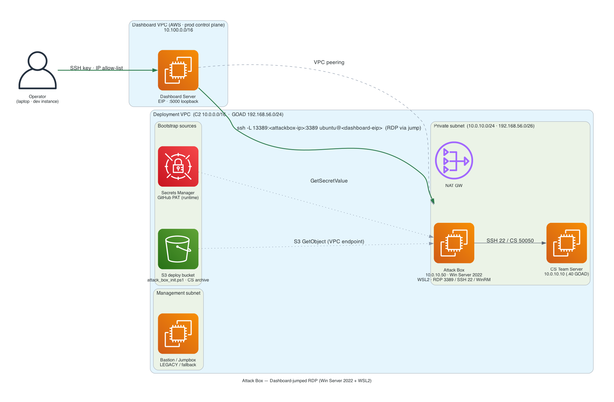

# Windows Attack Box - Detailed Architecture



## Overview

The **Windows Attack Box** is a standalone Terraform module (`terraform/modules/attack_box/`) providing a **Windows Server 2022 workstation** optimized for red team operations. It deploys across the **11 C2 / GOAD / combined deployment types** with automatic VPC-aware placement. (The 12th type, the self-contained `ccrts` lab, does **not** use this shared attack box — its candidate workstation is the CREST Kali host, where CS runs directly.)

**Key Design Decisions:**
- **Standalone module** — not embedded in GOAD or C2 modules, reusable everywhere
- **S3 bootstrap pattern** — bypasses EC2's 16KB user_data limit for large init scripts
- **Secrets Manager for credentials** — GitHub PAT fetched at runtime, never stored in S3 scripts
- **Static private IPs** — predictable addressing for SSH configs and documentation
- **Toggleable** — `enable_attack_box = true` (default), disable to save ~$50/month

## Module Location

```
terraform/modules/attack_box/
├── main.tf                              # Instance, NIC, S3 script upload
├── variables.tf                         # All input variables
├── outputs.tf                           # Instance ID, IP, password, RDP tunnel
└── scripts/
    ├── attack_box_bootstrap.ps1         # Lightweight bootstrap (< 16KB, user_data)
    └── attack_box_init.ps1              # Full init script (uploaded to S3)
```

## Deployment Across All Types

| Deployment Type | VPC | Subnet | Private IP | Access Via | Key Exchange |
|---|---|---|---|---|---|
| **c2-adhoc** | C2 VPC (10.0.0.0/16) | Private (10.0.10.0/24) | 10.0.10.50 | Dashboard Server tunnel | No |
| **c2-purple** | C2 VPC (10.0.0.0/16) | Private (10.0.10.0/24) | 10.0.10.50 | Dashboard Server tunnel | No |
| **c2-full** | C2 VPC (10.0.0.0/16) | Private (10.0.10.0/24) | 10.0.10.50 | Dashboard Server tunnel | No |
| **goad-mini** | GOAD VPC (192.168.56.0/24) | Private (192.168.56.0/26) | 192.168.56.50 | Dashboard Server tunnel | Yes (S3) |
| **goad-light** | GOAD VPC (192.168.56.0/24) | Private (192.168.56.0/26) | 192.168.56.50 | Dashboard Server tunnel | Yes (S3) |
| **goad-sccm** | GOAD VPC (192.168.56.0/24) | Private (192.168.56.0/26) | 192.168.56.50 | Dashboard Server tunnel | Yes (S3) |
| **goad-full** | GOAD VPC (192.168.56.0/24) | Private (192.168.56.0/26) | 192.168.56.50 | Dashboard Server tunnel | Yes (S3) |
| **goad-nha** | GOAD VPC (192.168.56.0/24) | Private (192.168.56.0/26) | 192.168.56.50 | Dashboard Server tunnel | Yes (S3) |
| **combined-adhoc-mini** | C2 VPC (10.0.0.0/16) | Private (10.0.10.0/24) | 10.0.10.50 | Dashboard Server tunnel | No |
| **combined-adhoc-light** | C2 VPC (10.0.0.0/16) | Private (10.0.10.0/24) | 10.0.10.50 | Dashboard Server tunnel | No |
| **combined-full-full** | C2 VPC (10.0.0.0/16) | Private (10.0.10.0/24) | 10.0.10.50 | Dashboard Server tunnel | No |

### VPC Placement Logic (from `main.tf`)

```hcl
# Network placement: C2 VPC for C2/combined, GOAD VPC for GOAD-only
subnet_id         = local.is_goad_only ? module.goad[0].private_subnet_id : module.vpc[0].private_subnet_ids[0]
security_group_id = local.is_goad_only ? module.goad[0].security_group_id : module.security[0].attack_box_security_group_id
private_ip        = local.is_goad_only ? "${local.goad_ip_range}.50" : local.attack_box_private_ip  # 10.0.10.50

# C2 Server connection (for CS Client shortcut on desktop)
c2_server_ip   = local.is_goad_only ? "${local.goad_ip_range}.40" : local.c2_server_private_ips[0]  # 10.0.10.10

# Key exchange (GOAD-only: S3-based SSH key exchange with jumpbox)
enable_key_exchange = local.is_goad_only
```

## Architecture: C2/Combined Mode

```
Dashboard Server (own VPC, EIP) ── VPC peering ──► reaches the attack box directly

C2 VPC (10.0.0.0/16)
├── Private Subnet (10.0.10.0/24) — NO public IPs
│   ├── C2 Team Server (10.0.10.10)    ← CS Team Server (port 50050)
│   └── Attack Box (10.0.10.50)        ← Windows workstation ← Dashboard reaches via peering
│
└── Security Groups:
    attack_box_sg:
      Ingress: RDP 3389 + SSH 22 + WinRM 5985 from dashboard SG (via VPC peering)
      Egress: All outbound (0.0.0.0/0)
    c2_team_server_sg (allows from attack_box_sg):
      Ingress: SSH 22 + CS mgmt 50050 from attack_box_sg
```

**Operator Access:**
```bash
# SSH tunnel through the Dashboard Server to attack box RDP (peering routes the last hop)
ssh -i key.pem -L 13389:10.0.10.50:3389 ubuntu@<dashboard-eip>
mstsc /v:localhost:13389   # Login: Administrator / <password from terraform output>
```

## Architecture: GOAD-Only Mode

```
Dashboard Server (own VPC, EIP) ── VPC peering ──► reaches every GOAD instance directly

GOAD VPC (192.168.56.0/24)
├── Public Subnet (192.168.56.64/26)
│   └── Jumpbox (192.168.56.100, EIP)  ← legacy/fallback SSH gateway
│
├── Private Subnet (192.168.56.0/26)
│   ├── Team Server (192.168.56.40)    ← CS Team Server
│   ├── Attack Box (192.168.56.50)     ← Windows workstation ← Dashboard reaches via peering
│   └── AD VMs (192.168.56.10-23)      ← Domain controllers
│
└── Security Group: goad_sg (shared)
    Ingress: All traffic within VPC CIDR + SSH/RDP from management CIDRs + dashboard SG
    Egress: HTTP, HTTPS, DNS, ICMP, internal
```

**Operator Access:**
```bash
# Option 1: RDP tunnel through the Dashboard Server
ssh -i key.pem -L 13389:192.168.56.50:3389 ubuntu@<dashboard-eip>
mstsc /v:localhost:13389   # Login: Administrator / <password>

# Option 2: CS Client tunnel through the Dashboard Server (run CS on your laptop)
ssh -i key.pem -L 50050:192.168.56.40:50050 ubuntu@<dashboard-eip>
# Then connect CS Client to localhost:50050

# Legacy fallback (jumpbox): swap <dashboard-eip> for <jumpbox-eip> in either tunnel above
```

### GOAD Key Exchange (S3-Based)

In GOAD-only mode, the attack box and jumpbox exchange SSH keys via S3 for passwordless internal access:

```
Jumpbox (Ubuntu):
  1. Generates Ed25519 key pair during bootstrap
  2. Uploads public key to: s3://<bucket>/keys/<project>/jumpbox_internal.pub
  3. Downloads attack box public key from S3 → adds to authorized_keys

Attack Box (Windows):
  1. Downloads jumpbox public key from S3 (retries 60x, 10s intervals)
  2. Installs to C:\ProgramData\ssh\administrators_authorized_keys
  3. Generates Ed25519 key pair for outbound SSH
  4. Uploads public key to: s3://<bucket>/keys/<project>/attackbox_internal.pub
```

After key exchange completes, from the attack box:
```powershell
# SSH config auto-created — just type:
ssh teamserver   # Connects to 192.168.56.40

# Or from WSL:
ssh ubuntu@192.168.56.40
```

## Instance Specification

| Property | Value |
|---|---|
| **AMI** | Windows Server 2022 Full Base (latest, auto-detected) |
| **Instance Type** | t2.large (default — 8GB RAM for CS Client + tools) |
| **Root Volume** | 100GB gp3, encrypted, delete on termination |
| **Network Interface** | Dedicated ENI with static private IP |
| **IAM Profile** | C2 or GOAD instance profile (S3 access for CS + scripts) |
| **Monitoring** | Configurable (default: basic) |
| **Public IP** | None (private subnet only) |

## S3 Bootstrap Pattern

The full init script (`attack_box_init.ps1`) exceeds EC2's 16KB user_data limit. The module uses a two-stage bootstrap:

```
Stage 1: EC2 User Data (< 16KB)
  attack_box_bootstrap.ps1 → Runs at instance launch
    1. Installs OpenSSH Server (SSH access guaranteed even if init fails)
    2. Loads IAM credentials via IMDSv2
    3. Downloads attack_box_init.ps1 from S3 (retries 5x)
    4. Executes the full init script

Stage 2: S3 Upload (Terraform)
  aws_s3_object.attack_box_init_script → Uploads templated script to:
    s3://<deployment_bucket>/<project_name>/scripts/attack_box_init.ps1

Stage 3: Runtime Secrets (Init Script)
  Phase 4 fetches GitHub PAT from Secrets Manager via Get-SECSecretValue
    → Token used for git clone, then immediately cleared from memory (OPSEC)
    → Token NEVER appears in S3-stored scripts
  Phase 5 clones 98 Cobalt Strike Community Kit repos (public, no token needed)
    → Organized into C:\CommunityTools by category (BOF, Aggressor, etc.)
```

The bootstrap only needs 4 variables (bucket, deployment_id, region, ssh_public_key). All other configuration is templated into the S3 script. Sensitive credentials (GitHub PAT) are resolved at runtime from AWS Secrets Manager.

### Lifecycle Protection

```hcl
lifecycle {
  ignore_changes = [user_data]
}
```

Script changes don't trigger instance recreation. Use `terraform taint` to force rebuild when needed.

## Init Script Phases

The init script (`attack_box_init.ps1`) runs 9 phases:

### Phase 1: Remove Server Bloat
- Disable Server Manager auto-start
- Disable IE Enhanced Security Configuration
- Optimize for foreground programs (not background services)
- Stop unnecessary server services (W3SVC, MSSQLSERVER, etc.)

### Phase 2: Disable Windows Defender
- Registry keys: DisableAntiSpyware, DisableAntiVirus, DisableRealtimeMonitoring
- PowerShell cmdlets: Set-MpPreference for all protection types
- Exclusion paths: `C:\Tools`, `C:\Payloads`, `C:\Tools\CobaltStrike`
- Stop and disable WinDefend, WdNisSvc, WdBoot, WdFilter, Sense services

### Phase 3: System Configuration
- Set hostname to `attackbox-windows`
- Create directory structure: `C:\Tools`, `C:\CommunityTools`, `C:\Payloads`, `C:\Tools\CobaltStrike`, `.ssh`
- Set Administrator password (auto-generated 30-char or user-provided)
- Enable Remote Desktop (RDP)
- Install and start OpenSSH Server
- Install Chocolatey package manager
- Install tools via Chocolatey: Git, 7-Zip, Python 3, Java 17, AWS CLI, Windows Terminal, VS Code
- Install VS 2022 Build Tools + .NET Framework 4.8 Dev Pack (for compiling C# offensive tools)

### Phase 4: Clone Red Team Tools Repository
- Fetches GitHub PAT from AWS Secrets Manager at runtime (token never stored in S3 scripts)
- Clones `tools_repo_url` (default: `https://github.com/harr-sudo/red-team-tools.git`) to `C:\Tools`
- Falls back to cloning PowerSploit individually if no repo URL provided
- Auto-compiles all C# tools (Rubeus, Seatbelt, SharpUp, etc.) with MSBuild
  - Retargets .NET Framework 3.5/4.0 projects to 4.8 (old targeting packs unavailable)
  - Runs NuGet package restore before build
  - Binaries output to each tool's `bin\Release\` folder
  - **Note:** These are default (non-evasion) builds — will be detected by AV/EDR on targets. Operators should modify source and recompile for operational use.

### Phase 5: Cobalt Strike Community Kit
- Clones 98 tools from the [Cobalt Strike Community Kit](https://cobalt-strike.github.io/community_kit/) to `C:\CommunityTools`
- Organized into 10 category subfolders: BOF (55), Aggressor (20), Malleable-C2 (9), UDRL (4), REST-API (3), UDC2 (2), External-C2 (2), Infrastructure (1), Logging (1), RDLL (1)
- All repos shallow-cloned (`--depth 1`) to minimize disk usage and clone time
- Creates `README.txt` with category index in `C:\CommunityTools`
- Separate from `C:\Tools` (private tools repo) — community tools are public GitHub repos

### Phase 6: Install Cobalt Strike Client from S3
- Downloads CS archive from `cs_client_s3_path` (same S3 path as CS server archive)
- Auto-detects format (ZIP or tar.gz) and extracts to `C:\Tools\CobaltStrike`
- Finds `cobaltstrike.jar` and creates launch batch file
- Creates desktop shortcut "Cobalt Strike Client"

### Phase 7: WSL2 Setup
- Enables Windows Subsystem for Linux feature
- Enables Virtual Machine Platform
- Sets WSL default to version 1 (more compatible with EC2, no nested virt required)
- Installs Ubuntu (finalizes on first login)

### Phase 8: SSH Key Exchange (GOAD Only)
- Only runs when `enable_key_exchange = true`
- Downloads jumpbox public key from S3 (retries 60x, 10s intervals)
- Installs to `C:\ProgramData\ssh\administrators_authorized_keys`
- Generates Ed25519 key pair for outbound connections
- Uploads public key to S3 for jumpbox to download

### Phase 9: Desktop Shortcuts & SSH Config
- Creates SSH config for C2 server (`Host teamserver ts c2`)
- Creates `ATTACK-BOX-INFO.txt` on desktop with connection details
- Creates Payloads, Tools, and Community Tools desktop shortcuts
- Writes completion marker to `init_status.txt`

## Directory Layout on Attack Box

```
C:\
├── Tools\                   ← Red team tools (private GitHub repo clone)
│   ├── PowerSploit\
│   ├── SharpTools\
│   └── CobaltStrike\       ← CS Client installation
│       ├── cobaltstrike.jar
│       ├── Launch-CS-Client.bat
│       └── status.txt      ← "CS_CLIENT_INSTALLED" marker
│
├── CommunityTools\          ← Cobalt Strike Community Kit (98 public repos)
│   ├── BOF\                 ← 55 Beacon Object File tools
│   │   ├── nanodump\
│   │   ├── No-Consolation\
│   │   ├── CS-Situational-Awareness-BOF\
│   │   ├── CS-Remote-OPs-BOF\
│   │   ├── ChromeKatz\
│   │   ├── Inline-Execute-PE\
│   │   └── ...
│   ├── Aggressor\           ← 20 Aggressor script collections
│   │   ├── cobalt-arsenal\
│   │   ├── AggressorScripts\
│   │   ├── CSSG\
│   │   └── ...
│   ├── Malleable-C2\        ← 9 profile generators and collections
│   │   ├── Malleable-C2-Profiles\
│   │   ├── SourcePoint\
│   │   ├── C2concealer\
│   │   └── ...
│   ├── UDRL\                ← 4 User-Defined Reflective Loaders
│   │   ├── BokuLoader\
│   │   ├── AceLdr\
│   │   └── ...
│   ├── REST-API\            ← 3 REST API clients
│   ├── UDC2\                ← 2 User-Defined C2 channels
│   ├── External-C2\         ← 2 External C2 implementations
│   ├── Infrastructure\      ← 1 (RedWarden)
│   ├── Logging\             ← 1 (C2-logparser)
│   ├── RDLL\                ← 1 (SysmonQuiet)
│   └── README.txt           ← Category index
│
├── Payloads\                ← Empty — operator stages payloads here
│
├── Users\Administrator\
│   ├── Desktop\
│   │   ├── Cobalt Strike Client.lnk
│   │   ├── Payloads.lnk
│   │   ├── Tools.lnk
│   │   ├── Community Tools.lnk
│   │   ├── ATTACK-BOX-INFO.txt
│   │   ├── CS-LISTENER-GUIDE.txt
│   │   └── Deployment-Logs-Scripts\
│   │       ├── bootstrap.log
│   │       ├── attackbox-init.log
│   │       ├── attack_box_init_main.ps1
│   │       └── init_status.txt
│   └── .ssh\
│       ├── config           ← SSH config for teamserver alias
│       └── attackbox_internal_key[.pub]  ← GOAD mode only
│
└── ProgramData\ssh\
    └── administrators_authorized_keys    ← GOAD mode only
```

## Security Groups

### C2/Combined Mode: `attack_box_sg`

Defined in `terraform/modules/security/main.tf`:

```yaml
Inbound:
  - Port 3389 (RDP): from dashboard SG (via VPC peering)
  - Port 22 (SSH): from dashboard SG (via VPC peering)
  - Port 5985 (WinRM): from dashboard SG (TESTING ONLY — remove for production)

Outbound:
  - All traffic: 0.0.0.0/0
```

Additionally, the C2 team server SG (`c2_team_server_sg`) allows inbound from the attack box:

```yaml
C2 Team Server SG — rules sourced from attack_box_sg:
  - Port 22 (SSH): for CS operations and management
  - Port 50050 (CS management): for running CS client directly from attack box
```

The attack box is reachable from the Dashboard Server over VPC peering (the sole SSH/RDP jump). No direct internet access inbound. The attack box has direct access to the C2 team server on both SSH and the CS management port, so operators can run the CS client from the attack box without needing any external SSH tunnel.

### GOAD Mode: `goad_sg` (shared)

Defined in `terraform/modules/goad/security.tf`:

```yaml
Inbound:
  - All protocols: from GOAD VPC CIDR (internal communication)
  - Port 22 (SSH): from management CIDRs
  - Port 3389 (RDP): from management CIDRs
  - Port 5985-5986 (WinRM): from management CIDRs

Outbound:
  - HTTP (80), HTTPS (443), DNS (53): 0.0.0.0/0
  - ICMP: 0.0.0.0/0
  - All protocols: within GOAD VPC CIDR
```

The GOAD security group is shared by all VMs (jumpbox, team server, attack box, AD VMs) and allows full internal communication.

## Terraform Variables

### Root-Level Variables (`terraform/variables.tf`)

| Variable | Type | Default | Description |
|---|---|---|---|
| `enable_attack_box` | bool | `true` | Deploy the attack box (set false to save costs) |
| `attack_box_instance_type` | string | `"t2.large"` | EC2 instance type |
| `attack_box_root_volume_size` | number | `100` | Root volume GB |
| `attack_box_admin_password` | string (sensitive) | `""` | Windows password (empty = auto-generate) |

### Module Variables (passed from `main.tf`)

| Variable | Source | Notes |
|---|---|---|
| `subnet_id` | VPC module (C2 or GOAD) | Auto-selected based on deployment type |
| `security_group_id` | Security module (C2) or GOAD module | Auto-selected |
| `private_ip` | locals | `10.0.10.50` (C2) or `192.168.56.50` (GOAD) |
| `c2_server_ip` | locals | `10.0.10.10` (C2) or `192.168.56.40` (GOAD) |
| `deployment_bucket` | deployment_storage module | S3 bucket for scripts + CS files |
| `iam_instance_profile_name` | deployment_storage module | C2 or GOAD profile (VPC-restricted) |
| `enable_key_exchange` | locals | `true` for GOAD-only, `false` otherwise |
| `tools_repo_url` | root variable | Git repo for red team tools |

## Terraform Outputs

| Output | Value | Notes |
|---|---|---|
| `attack_box_instance_id` | EC2 instance ID | |
| `attack_box_private_ip` | `10.0.10.50` or `192.168.56.50` | Depends on deployment type |
| `attack_box_admin_password` | 30-char auto-generated or user-provided | Sensitive |
| `attack_box_rdp_tunnel` | `ssh -L 13389:<ip>:3389 ...` | RDP tunnel through the Dashboard Server |

## IAM Permissions

The attack box uses the same IAM instance profile as other instances in its VPC:

**C2/Combined mode** — `cs_storage` module's C2 instance profile:
- `s3:GetObject` on deployment bucket (scripts, CS files)
- `secretsmanager:GetSecretValue` on GitHub token secret (when `tools_repo_https_token` is set)
- VPC-restricted via `aws:SourceVpc` condition (S3 calls)

**GOAD mode** — `cs_storage` module's GOAD instance profile:
- `s3:GetObject` + `s3:PutObject` on deployment bucket (scripts, CS files, key exchange)
- `secretsmanager:GetSecretValue` on GitHub token secret (when `tools_repo_https_token` is set)
- VPC-restricted via `aws:SourceVpc` condition (S3 calls)

GOAD mode needs `s3:PutObject` for uploading the attack box's SSH public key during key exchange.

### GitHub Token Security
The GitHub PAT is stored in AWS Secrets Manager (not in S3 scripts). The init script fetches it at runtime using `Get-SECSecretValue` (AWSPowerShell). The IAM permission is scoped to the exact secret ARN. Other IAM users without explicit Secrets Manager access cannot read the token.

## Cost Breakdown

| Resource | Type | Cost/Month |
|---|---|---|
| EC2 Instance | t2.large (24/7) | ~$50 |
| EBS Volume | 100GB gp3 | ~$8 |
| **Total** | | **~$58** |

Set `enable_attack_box = false` to skip this component and save costs.

## Troubleshooting

### Init Script Didn't Run

```powershell
# Check bootstrap log (did it download the main script?)
type C:\Users\Administrator\Desktop\Deployment-Logs-Scripts\bootstrap.log

# Check main init log
type C:\Users\Administrator\Desktop\Deployment-Logs-Scripts\attackbox-init.log

# Check completion marker
type C:\Users\Administrator\Desktop\Deployment-Logs-Scripts\init_status.txt
# Should say: INIT_COMPLETE
```

### CS Client Not Installed

```powershell
# Check if CS was downloaded from S3
type C:\Tools\CobaltStrike\status.txt
# Should say: CS_CLIENT_INSTALLED

# Verify CS jar exists
dir C:\Tools\CobaltStrike\*.jar /s

# Check the init log for Phase 6 errors
findstr "PHASE 6" C:\Users\Administrator\Desktop\Deployment-Logs-Scripts\attackbox-init.log
```

### Cannot RDP to Attack Box

```bash
# Verify the SSH tunnel is active (through the Dashboard Server — the sole SSH jump)
ssh -i key.pem -L 13389:10.0.10.50:3389 ubuntu@<dashboard-eip>

# Check security group allows RDP from the dashboard SG (via VPC peering)
aws ec2 describe-security-groups --group-ids <attack-box-sg-id>

# Verify the instance is running
aws ec2 describe-instances --instance-ids <attack-box-id> --query 'Reservations[].Instances[].State.Name'
```

### GOAD Key Exchange Failed (GOAD Mode Only)

```powershell
# Check if jumpbox key was downloaded
dir C:\ProgramData\ssh\administrators_authorized_keys

# Check if attack box key was uploaded to S3
aws s3 ls s3://<bucket>/keys/<project>/attackbox_internal.pub

# Check init log for Phase 8 errors
findstr "PHASE 8" C:\Users\Administrator\Desktop\Deployment-Logs-Scripts\attackbox-init.log
```

### Tools Repository Not Cloned

```powershell
# Check if C:\Tools has contents
dir C:\Tools

# Check init log for Phase 4
findstr "PHASE 4" C:\Users\Administrator\Desktop\Deployment-Logs-Scripts\attackbox-init.log

# Manual clone if needed
git clone https://github.com/harr-sudo/red-team-tools.git C:\Tools
```

### Force Rebuild

```bash
# The lifecycle block prevents script-change rebuilds. To force:
cd terraform
terraform taint 'module.attack_box[0].aws_instance.attack_box'
terraform apply
```

## Migration from GOAD-Embedded Attack Box

The attack box was previously embedded in `terraform/modules/goad/attackbox.tf`. It has been migrated to a standalone module:

| Old (Embedded) | New (Standalone) |
|---|---|
| `modules/goad/attackbox.tf` | `modules/attack_box/main.tf` |
| `modules/goad/attackbox_scripts.tf` | S3 upload in `modules/attack_box/main.tf` |
| `modules/goad/scripts/attackbox_init.ps1` | `modules/attack_box/scripts/attack_box_init.ps1` |
| `modules/goad/scripts/attackbox_bootstrap.ps1` | `modules/attack_box/scripts/attack_box_bootstrap.ps1` |
| GOAD-only deployment | The 11 C2 / GOAD / combined deployment types (not `ccrts`) |
| GOAD VPC only | C2 VPC or GOAD VPC (auto-selected) |
| GOAD security group only | Dedicated attack_box_sg (C2) or goad_sg (GOAD) |

The GOAD module outputs still reference the attack box IP (`credentials.attackbox.ip = 192.168.56.50`) and access instructions, but the actual instance is now managed by the standalone module at the root level.

## References

- [C2 Ad-Hoc Architecture](./c2-adhoc.md) — Attack box in C2 VPC context
- [GOAD Mini Architecture](./goad-mini.md) — Attack box in GOAD VPC context
- [S3 Security Architecture](../legacy/internal/S3_CONFUSED_DEPUTY_FIX.md) — IAM roles and S3 bucket policies
- [SSH Key Management](./ssh-key-management.md) — Key exchange patterns
