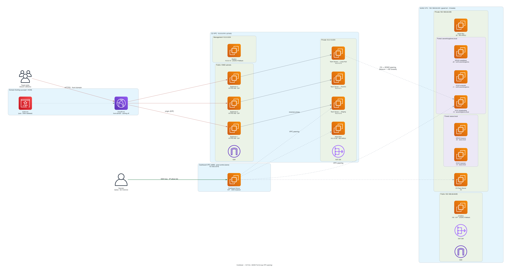

# Combined: C2 Full Red Team + GOAD Full

## Overview

The **Combined Full** deployment (`combined-full-full`) is the **largest and most capable deployment in the framework**: a complete **phase-based C2 Full Red Team** stack and the **complete multi-forest GOAD Full** lab, provisioned together and **peered** so the C2 infrastructure can run a full red-team simulation against an enterprise-scale Active Directory estate. Three Cobalt Strike team servers (staging / post-ex / long-haul) on one side; five Windows VMs across two forests and three domains on the other; a routed attack path between them.

This is the full-simulation deployment — every component of [C2 Full](./c2-full.md) and [GOAD Full](./goad-full.md) in a single apply. It maps to the Terraform `combined-full-full` deployment type, which deploys C2 in **`phases`** mode plus the **GOAD Full** lab and a VPC peering connection between them.

> 

## Architecture Components

A combined deployment is **two VPCs** joined by a peering connection. The Dashboard Server (a third VPC) peers with both.

### C2 VPC (10.0.0.0/16) — Full Red Team, phases mode

| Component | Phase | Type | Subnet | Private IP | Public IP | Purpose |
|-----------|-------|------|--------|-----------|-----------|---------|
| **Redirector 1** | — | t3.small (nginx) | DMZ (10.0.1.0/24) | 10.0.1.10 | EIP | Traffic forwarding (primary) |
| **Redirector 2** | — | t3.small (nginx) | DMZ (10.0.2.0/24) | 10.0.2.10 | EIP | Traffic forwarding (backup) |
| **C2 Team Server (Staging)** | staging | t3.medium | Private 1 (10.0.10.0/24) | 10.0.10.10 | None | Initial access / staging |
| **C2 Team Server (Post-Ex)** | post-ex | t3.medium | Private 2 (10.0.11.0/24) | 10.0.11.10 | None | Post-exploitation |
| **C2 Team Server (Long-Haul)** | long-haul | t3.medium | Private 1 (10.0.10.0/24) | 10.0.10.11 | None | Long-term persistence |
| **Attack Box** | — | t2.large (Win 2022) | Private 1 (10.0.10.0/24) | 10.0.10.50 | None | CS Client GUI, red team tools |
| **NAT Gateway** | — | Managed | Public | — | Auto | Outbound-only internet |

### GOAD VPC (192.168.56.0/24) — GOAD Full

| Component | Type | OS | Private IP | Domain / Role | Purpose |
|-----------|------|-----|-----------|---------------|---------|
| **Jumpbox** | t2.small | Ubuntu 22.04 | 192.168.56.100 | — | GOAD Ansible provisioning host + legacy SSH gateway (EIP) |
| **DC01 (kingslanding)** | t2.medium | Win 2019 | 192.168.56.10 | sevenkingdoms.local (Forest 1 root) | Root domain controller |
| **DC02 (winterfell)** | t2.medium | Win 2019 | 192.168.56.11 | north.sevenkingdoms.local (child) | Child domain controller |
| **DC03 (meereen)** | t2.medium | Win 2016 | 192.168.56.12 | essos.local (Forest 2 root) | Second-forest DC |
| **SRV02 (castelblack)** | t2.medium | Win 2019 | 192.168.56.22 | north.sevenkingdoms.local (member) | Member server |
| **SRV03 (braavos)** | t2.medium | Win 2016 | 192.168.56.23 | essos.local (member) | Member server |
| **NAT Gateway** | Managed | — | — | — | Outbound-only internet for the AD lab |

> The combined attack box lives in the **C2 VPC** (10.0.10.50), and the three phase team servers live in the C2 VPC. GOAD Full in combined mode does **not** add a separate team server or attack box on the GOAD side — the C2 VPC's phase servers and attack box drive the engagement across the peering.

### Forest & Domain Structure (GOAD Full)

```
Forest 1: sevenkingdoms.local (Root)              Forest 2: essos.local (Root)
├── DC01 kingslanding  (sevenkingdoms.local)       └── DC03 meereen (essos.local)
└── DC02 winterfell    (north.sevenkingdoms.local)     └── SRV03 braavos (member)
    └── SRV02 castelblack (member)

Trusts:
  sevenkingdoms.local  ⇄  north.sevenkingdoms.local   (parent-child, transitive)
  sevenkingdoms.local  ⇄  essos.local                 (inter-forest trust)
```

That gives **3 domains across 2 forests** with mixed Windows Server 2016/2019 — the full GOAD attack surface, including cross-forest trust abuse. See [GOAD Full](./goad-full.md) for the complete forest breakdown.

### VPC Peering

```
Dashboard VPC (10.100.0.0/16)
   ├── peering ──► C2 VPC   (10.0.0.0/16)
   └── peering ──► GOAD VPC (192.168.56.0/24)

C2 VPC (10.0.0.0/16) ◄────── peering ──────► GOAD VPC (192.168.56.0/24)
```

The `vpc_peering` module connects the C2 VPC and the GOAD VPC and writes the cross-VPC routes onto **all** route tables on both sides (private, public, management). All three phase team servers and the attack box therefore have a **direct routed path** to the entire GOAD estate (192.168.56.0/24) — the path beacons and tools use to traverse the parent-child and inter-forest trusts. The Dashboard Server peers separately with each VPC for operator access.

### Network Architecture

```
                         Operator Laptop (dev dashboard only)
                                  │ SSH tunnel :5000
                                  ▼
                    Dashboard VPC 10.100.0.0/16 (Dashboard Server, EIP)
                          │ peering              │ peering
        ┌─────────────────┘                      └──────────────────┐
        ▼                                                            ▼
┌──────────────────────────────────┐   peering   ┌────────────────────────────────────┐
│  C2 VPC  10.0.0.0/16             │◄───────────►│  GOAD VPC  192.168.56.0/24          │
│  DMZ (10.0.1.0/24, 10.0.2.0/24) │             │  Public (192.168.56.64/26)          │
│   ├── Redirector 1 (10.0.1.10)  │             │   ├── Jumpbox (.100, EIP)           │
│   └── Redirector 2 (10.0.2.10)  │             │   ├── Internet Gateway              │
│  Private (10.0.10.0/24, .11.0/24)│             │   └── NAT Gateway                   │
│   ├── Staging   (10.0.10.10)     │             │  Private (192.168.56.0/26)          │
│   ├── Long-Haul (10.0.10.11)     │             │   ├── DC01 kingslanding (.10)       │
│   ├── Post-Ex   (10.0.11.10)     │  ── attack ─►│   ├── DC02 winterfell   (.11)       │
│   └── Attack Box (10.0.10.50)    │             │   ├── DC03 meereen      (.12)       │
│  NAT Gateway → Internet          │             │   ├── SRV02 castelblack (.22)       │
└──────────────────────────────────┘             │   └── SRV03 braavos     (.23)       │
                                                  └────────────────────────────────────┘

Beacon traffic:  Target → HTTPS :443 → Redirector 1/2 → C2 Staging :443 (migrate to post-ex/long-haul)
Attack path:     C2 phase servers / Attack Box → VPC peering → GOAD estate (192.168.56.0/24)
```

Both VPCs keep their standard internal layout. Only the redirector EIPs and the jumpbox EIP are public; no team server, attack box, or AD VM is directly internet-facing. Operator access is via the dashboard.

## Key Features

### 1. Full Red-Team Simulation
- **Phase-compartmentalized C2** (staging / post-ex / long-haul) attacking a **multi-forest** AD estate
- The complete chain: staging callbacks → migrate to post-ex → cross-domain and cross-forest movement → long-haul persistence
- Realistic OpSec: a staging burn never exposes post-ex or long-haul, and trust abuse spans two forests

### 2. C2 Full Red Team (three phase servers)
- Staging (10.0.10.10), Post-Ex (10.0.11.10), Long-Haul (10.0.10.11) — see [C2 Full](./c2-full.md)
- Each phase independently configurable (instance type, disk, profile, domain) and toggleable

### 3. GOAD Full (multi-forest lab)
- Two forests (sevenkingdoms.local + essos.local), three domains, inter-forest + parent-child trusts
- Five Windows VMs with mixed Server 2016/2019, member servers for coercion/delegation/SQL — see [GOAD Full](./goad-full.md)

### 4. Single Attack Box (C2 VPC)
- Windows Server 2022 (10.0.10.50) with CS Client + tools, reached via RDP tunnel through the Dashboard Server

## Deployment

### Configuration

```hcl
# terraform.tfvars
deployment_type = "combined-full-full"   # C2 phases mode + GOAD Full + VPC peering

# Network (defaults shown — two distinct CIDRs)
vpc_cidr      = "10.0.0.0/16"        # C2 VPC
goad_vpc_cidr = "192.168.56.0/24"    # GOAD VPC

# Per-phase C2 config defaults to all three phases enabled (t3.medium, 20GB).
# Override via c2_phases if you want to disable a phase or resize.

# Domains (REQUIRED for the C2 side; multiple backups recommended for per-phase separation)
primary_domain_name = "operations.company.com"
backup_domains      = ["cdn.company.com", "static.company.com"]

# Access Control
management_cidr_blocks = ["YOUR.PUBLIC.IP/32"]
```

### Via Web Application

1. Navigate to **Configuration**
2. Set **Deployment Type**: "Full C2 + GOAD Full"
3. Upload the **Cobalt Strike distribution** archive
4. Configure the **Domain** (required for the C2 side)
5. Click **Deploy**

### Via Command Line

```bash
cd terraform
terraform init -var-file=../configs/terraform.tfvars
terraform apply -var="deployment_type=combined-full-full"
```

### Provisioning timeline

1. **Infrastructure (~20-25 min)** — both VPCs, the peering connection, the three phase team servers, the redirectors, the attack box, and the five GOAD Full VMs.
2. **GOAD provisioning (~60-90 min)** — the jumpbox runs the GOAD Full Ansible playbooks against all five DCs/servers: domain promotion, parent-child + inter-forest trust configuration, vulnerable-object seeding. Trigger from the dashboard's GOAD provisioning view. This is the longest provisioning step in the framework.

## Security Groups

Each VPC keeps its own security groups; the peering routes plus these rules permit the cross-VPC attack path.

- **C2 side** — `proxy_redirector_sg`, `c2_team_server_sg` (shared by all three phase servers), and `attack_box_sg` behave as in [C2 Full](./c2-full.md#security-groups), with the team-server SG permitting egress to the GOAD CIDR for the attack path.
- **GOAD side** — the shared `goad_sg` allows all traffic from within the GOAD VPC **and from the peer C2 VPC CIDR (10.0.0.0/16)**, plus SSH/RDP/WinRM from `management_cidr_blocks`. This lets the C2 phase servers and attack-box tools reach all five AD VMs.

> The GOAD shared SG is intentional — it is a deliberately vulnerable training lab. Isolation comes from the private subnet and the management IP allow-list.

## Access Methods

The **Dashboard Server** is the operator entry point and jump host for **both** VPCs.

```bash
# Dashboard UI (single tunnel)
ssh -L 5000:localhost:5000 ubuntu@<dashboard-eip>
# http://localhost:5000 — terminal, topology (both VPCs), CS beacons (all phases), GOAD provisioning

# CS Client → all three phase team servers (C2 VPC) through the dashboard
ssh -i ~/.ssh/key.pem \
    -L 50050:10.0.10.10:50050 \
    -L 50051:10.0.11.10:50050 \
    -L 50052:10.0.10.11:50050 \
    ubuntu@<dashboard-eip>
#   Staging → 127.0.0.1:50050, Post-Ex → :50051, Long-Haul → :50052

# RDP → attack box (C2 VPC) through the dashboard
ssh -L 13389:10.0.10.50:3389 -i ~/.ssh/key.pem ubuntu@<dashboard-eip>

# RDP → GOAD domain controllers through the dashboard
ssh -L 3391:192.168.56.10:3389 -i ~/.ssh/key.pem ubuntu@<dashboard-eip>   # DC01 (sevenkingdoms)
ssh -L 3392:192.168.56.11:3389 -i ~/.ssh/key.pem ubuntu@<dashboard-eip>   # DC02 (north)
ssh -L 3393:192.168.56.12:3389 -i ~/.ssh/key.pem ubuntu@<dashboard-eip>   # DC03 (essos)

# SOCKS proxy for sweeping the AD subnet
ssh -D 1080 -i ~/.ssh/key.pem ubuntu@<dashboard-eip>
proxychains crackmapexec smb 192.168.56.0/26
```

> **Legacy fallback:** the GOAD jumpbox EIP still works as an SSH gateway into the GOAD VPC if the dashboard is unavailable. It is otherwise the Ansible provisioning host, not an access path.

## Cost Breakdown

### Monthly Cost Estimate: ~$500-600

| Resource | Type | Cost/Month |
|----------|------|------------|
| C2 Phase Servers (staging/post-ex/long-haul) | t3.medium x3 | ~$90 |
| Redirector 1 / 2 | t3.small x2 | ~$30 |
| Attack Box | t2.large | ~$50 |
| GOAD Jumpbox | t2.small | ~$17 |
| GOAD DCs (DC01/DC02/DC03) | t2.medium x3 | ~$99 |
| GOAD Member Servers (SRV02/SRV03) | t2.medium x2 | ~$66 |
| NAT Gateways | 2 (one per VPC) | ~$64 |
| EBS Storage | combined | ~$30 |
| Data Transfer | minimal | ~$15-20 |
| S3 / VPC peering | peering has no hourly charge | ~$5 |
| **Total** | | **~$500-600** |

> This is the most expensive deployment — eleven instances across two VPCs plus two NAT Gateways. **Stop instances when idle** to save ~70%, and consider disabling C2 phases you are not using (`c2_phases.<phase>.enabled = false`) to trim the team-server count.

## Dashboard Server (Production Control Plane)

The dashboard runs on a dedicated AWS EC2 instance in its own VPC. It is the **production control plane and sole SSH jump host**, peering independently with **both** the C2 and GOAD VPCs so it reaches every instance directly. There is no per-deployment SSH-relay bastion; the GOAD jumpbox is the Ansible provisioning host. The operator's laptop only runs a *dev* instance of the dashboard.

### VPC Peering Summary

| Peering | CIDRs | Purpose |
|---------|-------|---------|
| Dashboard ⇄ C2 | 10.100.0.0/16 ⇄ 10.0.0.0/16 | Operator access to redirectors, phase servers, attack box |
| Dashboard ⇄ GOAD | 10.100.0.0/16 ⇄ 192.168.56.0/24 | Operator access to jumpbox + 5 AD VMs |
| **C2 ⇄ GOAD** | 10.0.0.0/16 ⇄ 192.168.56.0/24 | **Attack path** — beacons/tools traverse the AD estate |

### Dashboard Access to Instances

| Target | VPC | Ports | Purpose |
|--------|-----|-------|---------|
| Redirector 1/2 (10.0.1.10 / 10.0.2.10) | C2 | SSH/22 | nginx config, health checks |
| C2 Staging / Post-Ex / Long-Haul (10.0.10.10 / 10.0.11.10 / 10.0.10.11) | C2 | SSH/22, CS/50050, REST/50443 | Shell, CS client tunnel, REST API |
| Attack Box (10.0.10.50) | C2 | SSH/22 | Management shell, RDP tunnel |
| Jumpbox (192.168.56.100) | GOAD | SSH/22 | Ansible provisioning |
| DC01 / DC02 / DC03 (.10 / .11 / .12) | GOAD | RDP/3389, WinRM/5985 | Lab access via dashboard tunnel |
| SRV02 / SRV03 (.22 / .23) | GOAD | RDP/3389, WinRM/5985 | Lab access via dashboard tunnel |

## Related Documentation

- [C2 Full Red Team Architecture](./c2-full.md) — the C2 half of this deployment
- [GOAD Full Architecture](./goad-full.md) — the lab half of this deployment
- [Combined Mini (C2 + GOAD Mini)](./combined-mini.md) — entry-level combined option
- [Combined Light (C2 + GOAD Light)](./combined-light.md) — intermediate combined option
- [Deployment Modes](../DEPLOYMENT_MODES.md) — all 12 deployment types
- [GOAD Quick Start](../GOAD_QUICK_START.md) — provisioning + CS-to-GOAD connection
- [Diagrams Index](./DIAGRAMS_INDEX.md) — all architecture diagrams

## Summary

Combined Full is **C2 Full Red Team + GOAD Full, peered** — the framework's complete red-team simulation.

- ✅ Two peered VPCs: phase-based C2 (10.0.0.0/16) attacks a multi-forest GOAD estate (192.168.56.0/24)
- ✅ Three phase team servers (staging/post-ex/long-haul) + redundant redirectors + attack box
- ✅ Five-VM, two-forest, three-domain AD lab with parent-child and inter-forest trusts
- ✅ Dashboard Server peers with both — sole jump host, no per-deployment bastion

**Cost**: ~$500-600/month (the highest in the framework). The destination deployment for advanced, full-scope red-team training and simulation.
