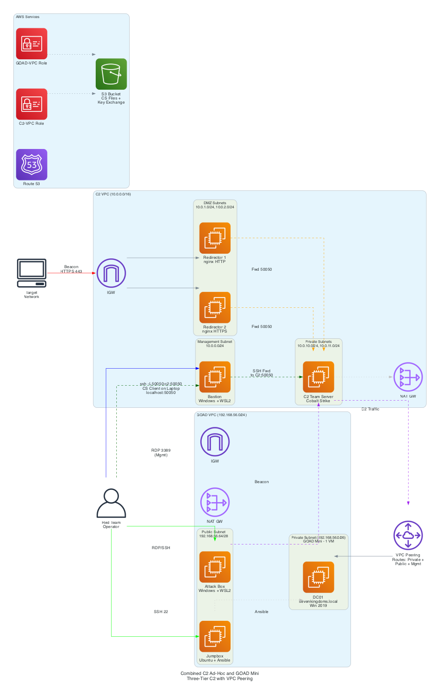

# Combined: C2 Ad-Hoc + GOAD Mini

## Overview

The **Combined Mini** deployment (`combined-adhoc-mini`) provisions a **full C2 Ad-Hoc stack and a GOAD Mini lab in one apply**, then **peers the two VPCs together** so the C2 infrastructure can attack the AD lab as if it were a real target environment. It is the entry-level combined deployment: a single Cobalt Strike team server with redundant redirectors on one side, a single-DC training lab on the other, and a routed path between them.

This is the cheapest way to practice an end-to-end engagement with **realistic C2** — beacons callback through redirectors to the team server, then pivot across the VPC peering into the GOAD AD lab. It maps to the Terraform `combined-adhoc-mini` deployment type, which deploys C2 in **`single`** mode plus the **GOAD-Mini** lab and a VPC peering connection.

> 

## Architecture Components

A combined deployment is **two VPCs** joined by a peering connection. The Dashboard Server (a third VPC) peers with both.

### C2 VPC (10.0.0.0/16) — Ad-Hoc, single mode

| Component | Type | Subnet | Private IP | Public IP | Purpose |
|-----------|------|--------|-----------|-----------|---------|
| **Redirector 1** | t3.small (nginx HTTPS) | DMZ (10.0.1.0/24) | 10.0.1.10 | EIP | Traffic forwarding (primary) |
| **Redirector 2** | t3.small (nginx HTTPS) | DMZ (10.0.2.0/24) | 10.0.2.10 | EIP | Traffic forwarding (backup) |
| **C2 Team Server** | t3.medium (Cobalt Strike) | Private (10.0.10.0/24) | 10.0.10.10 | None | Cobalt Strike team server |
| **Attack Box** | t2.large (Windows 2022) | Private (10.0.10.0/24) | 10.0.10.50 | None | CS Client GUI, red team tools |
| **NAT Gateway** | Managed | Public | — | Auto | Outbound-only internet for private instances |

### GOAD VPC (192.168.56.0/24) — GOAD Mini

| Component | Type | Subnet | Private IP | Public IP | Purpose |
|-----------|------|--------|-----------|-----------|---------|
| **Jumpbox** | t2.small (Ubuntu) | Public (192.168.56.64/26) | 192.168.56.100 | EIP | GOAD Ansible provisioning host + legacy SSH gateway |
| **DC01 (kingslanding)** | t2.medium (Win 2019) | Private (192.168.56.0/26) | 192.168.56.10 | None | Domain Controller — sevenkingdoms.local |
| **NAT Gateway** | Managed | Public | — | Auto | Outbound-only internet for the AD lab |

> The combined attack box lives in the **C2 VPC** (10.0.10.50). GOAD Mini in combined mode does **not** add a second team server or attack box on the GOAD side — the C2 VPC's team server and attack box drive the engagement across the peering. (The standalone `goad-mini` deployment provisions its own CS team server at 192.168.56.40; in combined mode that role is filled by the C2 VPC.)

### VPC Peering

```
Dashboard VPC (10.100.0.0/16)
   ├── peering ──► C2 VPC   (10.0.0.0/16)
   └── peering ──► GOAD VPC (192.168.56.0/24)

C2 VPC (10.0.0.0/16) ◄────── peering ──────► GOAD VPC (192.168.56.0/24)
```

The `vpc_peering` module connects the C2 VPC and the GOAD VPC and writes the cross-VPC routes onto **all** route tables on both sides (private, public, and management). This means the C2 team server (10.0.10.10) and the attack box (10.0.10.50) have a **direct routed path** to the GOAD AD lab (192.168.56.0/24), and vice-versa — exactly the path beacons and tools use to attack the lab.

The Dashboard Server has its **own** peering to each VPC, so it reaches every instance in both — no traffic between the operator and a lab host ever transits the other VPC.

### Network Architecture

```
                         Operator Laptop (dev dashboard only)
                                  │ SSH tunnel :5000
                                  ▼
                    Dashboard VPC 10.100.0.0/16 (Dashboard Server, EIP)
                          │ peering              │ peering
        ┌─────────────────┘                      └──────────────────┐
        ▼                                                            ▼
┌──────────────────────────────────┐   peering   ┌────────────────────────────────────┐
│  C2 VPC  10.0.0.0/16             │◄───────────►│  GOAD VPC  192.168.56.0/24          │
│  DMZ (10.0.1.0/24, 10.0.2.0/24) │             │  Public (192.168.56.64/26)          │
│   ├── Redirector 1 (10.0.1.10)  │             │   ├── Jumpbox (.100, EIP)           │
│   └── Redirector 2 (10.0.2.10)  │             │   ├── Internet Gateway              │
│  Private (10.0.10.0/24)          │             │   └── NAT Gateway                   │
│   ├── C2 Team Server (10.0.10.10)│             │  Private (192.168.56.0/26)          │
│   └── Attack Box (10.0.10.50)    │  ── attack ─►│   └── DC01 kingslanding (.10)       │
│  NAT Gateway → Internet          │             │       sevenkingdoms.local           │
└──────────────────────────────────┘             └────────────────────────────────────┘

Beacon traffic:  Target/DC01 → HTTPS :443 → Redirector 1/2 → C2 Team Server :443
Attack path:     C2 / Attack Box → VPC peering → GOAD AD lab (192.168.56.0/24)
```

Both VPCs keep their standard internal layout: the C2 VPC has public DMZ subnets (redirectors with EIPs) and private subnets (team server, attack box); the GOAD VPC has a public subnet (jumpbox) and a private subnet (DC01). Neither lab host nor team server is directly internet-facing.

## Key Features

### 1. Realistic End-to-End Engagement
- **Beacons callback through redirectors** to the team server, just like a real operation
- **Pivot across VPC peering** into the AD lab — no shortcuts
- Practice the full chain: payload delivery → callback → lateral movement into AD → DCSync

### 2. C2 Ad-Hoc (single team server)
- One t3.medium Cobalt Strike server (10.0.10.10) behind two redundant redirectors
- Same network shape and SSL/redirector behaviour as the standalone [C2 Ad-Hoc](./c2-adhoc.md)

### 3. GOAD Mini (single-DC lab)
- DC01 kingslanding (192.168.56.10), domain **sevenkingdoms.local**, Windows Server 2019
- Jumpbox (192.168.56.100) provisions the lab via Ansible
- All the GOAD Mini vulnerabilities — Kerberoasting, AS-REP roasting, weak passwords, delegation

### 4. Single Attack Box (C2 VPC)
- Windows Server 2022 (10.0.10.50) with CS Client + tools, reached via RDP tunnel through the Dashboard Server
- Drives the engagement against the peered GOAD lab

## Deployment

### Configuration

```hcl
# terraform.tfvars
deployment_type = "combined-adhoc-mini"   # C2 single mode + GOAD-Mini + VPC peering

# Network (defaults shown — note the two distinct CIDRs)
vpc_cidr      = "10.0.0.0/16"        # C2 VPC
goad_vpc_cidr = "192.168.56.0/24"    # GOAD VPC

# Domains (REQUIRED for the C2 side)
primary_domain_name = "operations.company.com"
backup_domains      = ["cdn.company.com"]

# Access Control
management_cidr_blocks = ["YOUR.PUBLIC.IP/32"]
```

### Via Web Application

1. Navigate to **Configuration**
2. Set **Deployment Type**: "C2 + GOAD Mini"
3. Upload the **Cobalt Strike distribution** archive
4. Configure the **Domain** (required for the C2 side)
5. Click **Deploy**

### Via Command Line

```bash
cd terraform
terraform init -var-file=../configs/terraform.tfvars
terraform apply -var="deployment_type=combined-adhoc-mini"
```

### Provisioning timeline

1. **Infrastructure (~15-20 min)** — both VPCs, the peering connection, the C2 stack, and the GOAD Mini hosts.
2. **GOAD provisioning (~20-30 min)** — the jumpbox runs the GOAD-Mini Ansible playbook to promote DC01 and seed vulnerabilities. Trigger from the dashboard's GOAD provisioning view.

## Security Groups

Each VPC keeps its own security groups; the peering routes plus these rules permit the cross-VPC attack path.

- **C2 side** — `proxy_redirector_sg`, `c2_team_server_sg`, `attack_box_sg` behave exactly as in [C2 Ad-Hoc](./c2-adhoc.md#security-groups). The team-server SG additionally permits egress to the GOAD CIDR for the attack path.
- **GOAD side** — the shared `goad_sg` allows all traffic from within the GOAD VPC **and from the peer C2 VPC CIDR (10.0.0.0/16)**, plus SSH/RDP/WinRM from `management_cidr_blocks`. This is what lets C2 beacons and attack-box tools reach DC01.

> The GOAD shared SG is intentional — it is a deliberately vulnerable training lab. Isolation comes from the private subnet and the management IP allow-list.

## Access Methods

The **Dashboard Server** is the operator entry point and jump host for **both** VPCs. It peers with each independently and reaches every instance directly.

```bash
# Dashboard UI (single tunnel)
ssh -L 5000:localhost:5000 ubuntu@<dashboard-eip>
# http://localhost:5000 — terminal, topology (both VPCs), CS beacons, GOAD provisioning

# CS Client → team server (C2 VPC) through the dashboard
ssh -L 50050:10.0.10.10:50050 -i ~/.ssh/key.pem ubuntu@<dashboard-eip>

# RDP → attack box (C2 VPC) through the dashboard
ssh -L 13389:10.0.10.50:3389 -i ~/.ssh/key.pem ubuntu@<dashboard-eip>

# RDP → DC01 (GOAD VPC) through the dashboard
ssh -L 3391:192.168.56.10:3389 -i ~/.ssh/key.pem ubuntu@<dashboard-eip>
xfreerdp /v:localhost:3391 /u:Administrator /d:sevenkingdoms /p:'password'
```

> **Legacy fallback:** the GOAD jumpbox EIP still works as an SSH gateway into the GOAD VPC if the dashboard is unavailable. It is otherwise the Ansible provisioning host, not an access path.

## Cost Breakdown

### Monthly Cost Estimate: ~$180-220

| Resource | Type | Cost/Month |
|----------|------|------------|
| C2 Team Server | t3.medium | ~$30 |
| Redirector 1 / 2 | t3.small x2 | ~$30 |
| Attack Box | t2.large | ~$50 |
| GOAD Jumpbox | t2.small | ~$17 |
| GOAD DC01 | t2.medium | ~$33 |
| NAT Gateways | 2 (one per VPC) | ~$64 |
| EBS Storage | combined | ~$15 |
| Data Transfer | minimal | ~$5-10 |
| S3 / VPC peering | peering has no hourly charge | <$1 |
| **Total** | | **~$180-220** |

> Two NAT Gateways (one per VPC) are the main cost driver versus a single-VPC deployment. Cross-VPC data transfer over the peering is charged per GB but is minimal for lab traffic. **Stop instances when idle** to save ~70%.

## Dashboard Server (Production Control Plane)

The dashboard runs on a dedicated AWS EC2 instance in its own VPC. It is the **production control plane and sole SSH jump host**, peering independently with **both** the C2 and GOAD VPCs so it reaches every instance directly. There is no per-deployment SSH-relay bastion; the GOAD jumpbox is the Ansible provisioning host. The operator's laptop only runs a *dev* instance of the dashboard.

### VPC Peering Summary

| Peering | CIDRs | Purpose |
|---------|-------|---------|
| Dashboard ⇄ C2 | 10.100.0.0/16 ⇄ 10.0.0.0/16 | Operator access to redirectors, team server, attack box |
| Dashboard ⇄ GOAD | 10.100.0.0/16 ⇄ 192.168.56.0/24 | Operator access to jumpbox + DC01 |
| **C2 ⇄ GOAD** | 10.0.0.0/16 ⇄ 192.168.56.0/24 | **Attack path** — beacons/tools reach the AD lab |

### Dashboard Access to Instances

| Target | VPC | Ports | Purpose |
|--------|-----|-------|---------|
| Redirector 1/2 (10.0.1.10 / 10.0.2.10) | C2 | SSH/22 | nginx config, health checks |
| C2 Team Server (10.0.10.10) | C2 | SSH/22, CS/50050, REST/50443 | Shell, CS client tunnel, REST API |
| Attack Box (10.0.10.50) | C2 | SSH/22 | Management shell, RDP tunnel |
| Jumpbox (192.168.56.100) | GOAD | SSH/22 | Ansible provisioning |
| DC01 kingslanding (192.168.56.10) | GOAD | RDP/3389, WinRM/5985 | Lab access via dashboard tunnel |

## Related Documentation

- [C2 Ad-Hoc Architecture](./c2-adhoc.md) — the C2 half of this deployment
- [GOAD Mini Architecture](./goad-mini.md) — the lab half of this deployment
- [Combined Light (C2 + GOAD Light)](./combined-light.md) — next step up
- [Combined Full (C2 Full + GOAD Full)](./combined-full.md) — the largest combined deployment
- [Deployment Modes](../DEPLOYMENT_MODES.md) — all 12 deployment types
- [GOAD Quick Start](../GOAD_QUICK_START.md) — provisioning + CS-to-GOAD connection
- [Diagrams Index](./DIAGRAMS_INDEX.md) — all architecture diagrams

## Summary

Combined Mini is **C2 Ad-Hoc + GOAD Mini, peered** — the lowest-cost way to rehearse a full engagement against a real AD lab with realistic C2.

- ✅ Two peered VPCs: C2 (10.0.0.0/16) attacks GOAD (192.168.56.0/24)
- ✅ Single team server, redundant redirectors, one attack box (C2 VPC)
- ✅ Single-DC sevenkingdoms.local lab (GOAD VPC)
- ✅ Dashboard Server peers with both — sole jump host, no per-deployment bastion

**Cost**: ~$180-220/month. Ideal for training with realistic C2 on a budget.
