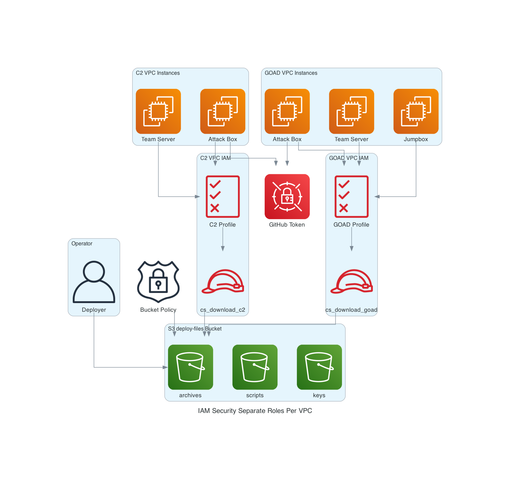

# IAM Security Architecture



## Overview

The deployment uses **Option C — Separate IAM Roles Per VPC** for maximum security. Each VPC gets its own IAM role with policies scoped to that specific VPC. Cross-VPC access is impossible by design.

## IAM Roles

### Role 1: `cs_download_c2` (C2 VPC)

**Created when:** C2 infrastructure is deployed (`c2-*` or `combined-*` modes)

**Used by:** Team Servers, Attack Box (in C2/combined mode)

| Permission | Resource | Conditions |
|-----------|----------|------------|
| `s3:GetObject`, `s3:GetObjectVersion`, `s3:ListBucket` | Deployment S3 bucket | `SourceVpc = C2 VPC` + `SecureTransport = true` |
| `s3:PutObject` | `keys/*` prefix | `SourceVpc = C2 VPC` + `SecureTransport = true` |
| `s3:PutObject`, `s3:GetObject` | `status/*` prefix | `SourceVpc = C2 VPC` |
| `logs:CreateLogGroup`, `logs:PutLogEvents`, etc. | `/aws/ec2/{project}*` | Account-scoped |
| `secretsmanager:GetSecretValue` | GitHub token secret ARN | Only if `github_token` is set |

**Instance Profile:** `{project}-{env}-cs-download-c2-profile`

### Role 2: `cs_download_goad` (GOAD VPC)

**Created when:** GOAD infrastructure is deployed (`goad-*` or `combined-*` modes)

**Used by:** Jumpbox, Attack Box (in GOAD-only mode), GOAD Team Server

Identical permission structure to the C2 role, but all VPC conditions reference the GOAD VPC ID.

**Instance Profile:** `{project}-{env}-cs-download-goad-profile`

### Role 3: `cs_download_legacy` (Backwards Compat)

**Created when:** Only `vpc_id` is provided and neither C2 nor GOAD roles are enabled.

Maintains backwards compatibility with older single-VPC deployments.

**Instance Profile:** `{project}-{env}-cs-download-profile`

## Instance Profile Assignment

| Instance | Profile | Source |
|----------|---------|--------|
| C2 Team Server (single/redundancy) | `instance_profile_name_c2` | `deployment_storage` module |
| C2 Phase Servers (c2-full) | `instance_profile_name_c2` | `deployment_storage` module |
| Attack Box (C2/combined) | `instance_profile_name_c2` | `deployment_storage` module |
| Attack Box (GOAD-only) | `instance_profile_name_goad` | `deployment_storage` module |
| GOAD Jumpbox | `instance_profile_name_goad` | `deployment_storage` module |
| GOAD Team Server | `instance_profile_name_goad` | `deployment_storage` module |
| Proxy Redirector | Manual variable | Not auto-assigned |
| Bastion | Manual variable | Not auto-assigned |

## 3-Layer Confused Deputy Protection

### Layer 1: IAM Trust Policy (`sts:AssumeRole`)

```
Principal: Service = ec2.amazonaws.com
Condition: StringEquals aws:SourceAccount = YOUR_ACCOUNT_ID
```

Only EC2 instances in YOUR AWS account can assume the role. `aws:SourceVpc` is not available in EC2 trust policies — VPC restriction is enforced at the permission layer instead.

### Layer 2: IAM Permission Policy (S3 Actions)

```
Condition: StringEquals aws:SourceVpc = C2_VPC_ID (or GOAD_VPC_ID)
Condition: Bool aws:SecureTransport = true
```

S3 requests must originate from the correct VPC AND use HTTPS. Cross-VPC access is blocked even if an attacker compromises an instance in a different VPC.

### Layer 3: S3 Bucket Policy (Defense-in-Depth)

| Statement | Effect | Condition |
|-----------|--------|-----------|
| `DenyAccessFromOutsideVPCs` | Deny `s3:*` | Request not from authorized VPCs AND not from deployer account |
| `DenyAccessFromOtherAccounts` | Deny `s3:*` | Request not from deployer's AWS account |
| `DenyUnencryptedTransport` | Deny `s3:*` | `aws:SecureTransport = false` |

The deployer's account is exempt from VPC checks (allows Terraform operations from outside the VPC).

## Secrets Manager

| Secret | Name Pattern | Accessed By | Permission |
|--------|-------------|-------------|------------|
| GitHub PAT | `{project}-{env}-github-token` | Attack Box (via `Get-SECSecretValue`) | `secretsmanager:GetSecretValue` scoped to exact ARN |

- Recovery window: 0 days (ephemeral infrastructure)
- Token never appears in S3-stored init scripts
- Attack box fetches at runtime using AWSPowerShell (pre-installed on Windows Server AMIs)

## IMDSv2 Enforcement

All EC2 instances across all modules enforce IMDSv2:

```hcl
metadata_options {
  http_endpoint               = "enabled"
  http_tokens                 = "required"   # Blocks IMDSv1 (prevents SSRF credential theft)
  http_put_response_hop_limit = 2
}
```

## Threats Mitigated

| Threat | Mitigation | Status |
|--------|-----------|--------|
| Confused Deputy Attack | `SourceAccount` + `SourceVpc` conditions | Blocked |
| Cross-VPC Access | Separate IAM roles per VPC | Blocked |
| Cross-Account Access | `SourceAccount` condition on trust + bucket policy | Blocked |
| Unencrypted Data Transfer | `SecureTransport` condition + bucket policy | Blocked |
| SSRF Credential Theft | IMDSv2 enforced on all instances | Blocked |
| Token Exposure in Scripts | Secrets Manager runtime fetch (not embedded) | Blocked |
| Public S3 Access | All 4 public access block settings enabled | Blocked |

## Related Files

| File | Purpose |
|------|---------|
| `terraform/modules/deployment_storage/main.tf` | IAM roles, policies, bucket policy |
| `terraform/modules/deployment_storage/variables.tf` | Role enable flags, VPC IDs |
| `terraform/modules/deployment_storage/outputs.tf` | Instance profile names/ARNs |
| `terraform/main.tf` | Profile assignment to instances (lines 360-602) |
