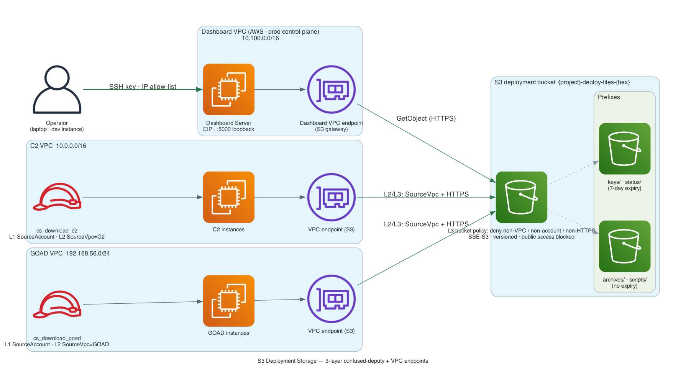

# Deployment Storage Architecture



## Overview

The `deployment_storage` module (`terraform/modules/deployment_storage/`) creates a per-deployment S3 bucket with IAM roles and Secrets Manager resources. It serves as the centralised storage layer for all deployment artifacts.

## S3 Prefix Structure

```
{project}-deploy-files-{hex}/
├── archives/          # CS server tar, CS client zip (persist until destroy)
├── scripts/           # Init scripts uploaded by Terraform modules (persist until destroy)
│   └── {project}/
│       ├── install_cobalt_strike.sh
│       ├── setup_redirector.sh
│       └── attack_box_init.ps1
├── keys/              # SSH public keys for key exchange (auto-expire 7 days)
│   └── {project}/
│       └── jumpbox_internal.pub
└── status/            # Bootstrap status files (auto-expire 7 days)
```

### Content-Hash Deduplication

Archives use content-hash based keys (SHA256) instead of timestamps:
- `archives/cs-server-a1b2c3d4e5f6.tar` (not `cobaltstrike-20260305-174447.tar`)
- `archives/cs-client-f6e5d4c3b2a1.zip` (not `cs-client/cs-client-20260305-174914.zip`)

If the same file is uploaded again, the upload is skipped (identical hash = identical key = `head_object` succeeds). This eliminates the duplication problem where repeated deployments created multiple copies of identical archives.

### Lifecycle Retention

| Prefix | Retention | Reason |
|--------|-----------|--------|
| `archives/` | **No expiry** | CS files needed for instance rebuilds throughout the engagement |
| `scripts/` | **No expiry** | Init scripts needed for instance rebuilds |
| `keys/` | 7 days | SSH keys only needed during initial bootstrap |
| `status/` | 7 days | Bootstrap status only needed during initial setup |
| All (noncurrent versions) | 7 days | Clean up old versions from versioned bucket |

All objects are removed when `terraform destroy` runs (`force_destroy = true`).

## IAM Security Architecture

### Option C — Separate IAM Roles Per VPC

Each VPC gets its own IAM role with policies scoped to that specific VPC. Cross-VPC access is impossible.

```
┌─────────────────────────────┐     ┌─────────────────────────────┐
│   IAM Role: cs_download_c2  │     │ IAM Role: cs_download_goad  │
│   SourceAccount: YOUR_ID    │     │ SourceAccount: YOUR_ID      │
│   SourceVpc: C2_VPC_ID      │     │ SourceVpc: GOAD_VPC_ID      │
│   SecureTransport: true     │     │ SecureTransport: true       │
└──────────────┬──────────────┘     └──────────────┬──────────────┘
               │                                    │
               ▼                                    ▼
┌──────────────────────────────────────────────────────────────────┐
│                        S3 BUCKET                                 │
│  Bucket Policy:                                                  │
│    - Deny access from non-authorized VPCs                        │
│    - Deny access from other AWS accounts                         │
│    - Deny non-HTTPS requests                                     │
└──────────────────────────────────────────────────────────────────┘
```

### 3-Layer Confused Deputy Protection

| Layer | Mechanism | What It Blocks |
|-------|-----------|----------------|
| **1. IAM Trust Policy** | `aws:SourceAccount` on `sts:AssumeRole` | Cross-account role assumption |
| **2. IAM Permission Policy** | `aws:SourceVpc` + `aws:SecureTransport` on S3 actions | Cross-VPC access, unencrypted requests |
| **3. S3 Bucket Policy** | VPC + account + HTTPS enforcement at bucket level | Any remaining bypass attempts |

### Role Assignments

| Deployment Type | VPCs | IAM Roles Created |
|----------------|------|-------------------|
| C2-only (`c2-adhoc`, `c2-purple`, `c2-full`) | C2 VPC | `cs_download_c2` |
| GOAD-only (`goad-mini`, `goad-light`, etc.) | GOAD VPC | `cs_download_goad` |
| Combined (`combined-*`) | Both | `cs_download_c2` + `cs_download_goad` |
| Dashboard Server (control plane) | Dashboard VPC (10.100.0.0/16) | Dashboard role (own VPC-endpoint S3 access) |

The Dashboard Server — the production control plane that all deployments branch from — has its own IAM role reaching the bucket through its VPC endpoint, conditioned on the Dashboard VPC. This adds another authorized source; the **3-layer confused-deputy model is unchanged**.

### Instance Permissions

| Instance | Actions | Prefixes |
|----------|---------|----------|
| Team Server, Redirector | `GetObject`, `ListBucket` | `archives/*`, `scripts/*` |
| Jumpbox | `GetObject`, `PutObject`, `ListBucket` | `archives/*`, `scripts/*`, `keys/*`, `status/*` |
| Attack Box | `GetObject`, `ListBucket` + `secretsmanager:GetSecretValue` | `archives/*`, `scripts/*`, `keys/*` |
| Dashboard Server | `GetObject`, `ListBucket` (via Dashboard VPC endpoint) | `archives/*`, `scripts/*` |

## Secrets Manager

The module optionally creates a Secrets Manager secret for the GitHub PAT:
- **Secret name**: `{sanitized_project}-{env}-github-token`
- **Recovery window**: 0 days (ephemeral infrastructure)
- **Accessed by**: Attack box via `Get-SECSecretValue` (AWSPowerShell) at runtime
- **IAM scoping**: `secretsmanager:GetSecretValue` allowed only for the specific secret ARN

The GitHub token is never embedded in init scripts stored on S3.

## Bucket Security Features

- **Encryption at rest**: AES256 (SSE-S3) — AWS-managed keys
- **Encryption in transit**: Enforced via `aws:SecureTransport` condition
- **Public access**: Blocked on all 4 settings (ACLs, policies, public access)
- **Versioning**: Enabled (with noncurrent version cleanup)
- **IMDSv2**: Required on all EC2 instances (prevents SSRF credential theft)

## Related Files

| File | Purpose |
|------|---------|
| `terraform/modules/deployment_storage/main.tf` | S3 bucket, IAM roles, bucket policy, Secrets Manager |
| `terraform/modules/deployment_storage/variables.tf` | Module input variables |
| `terraform/modules/deployment_storage/outputs.tf` | Bucket name, IAM profiles, secret name |
| `webapp/backend/utils/s3_upload.py` | Upload utility with content-hash dedup |
| `terraform/main.tf` | Module invocation (line ~261) |
