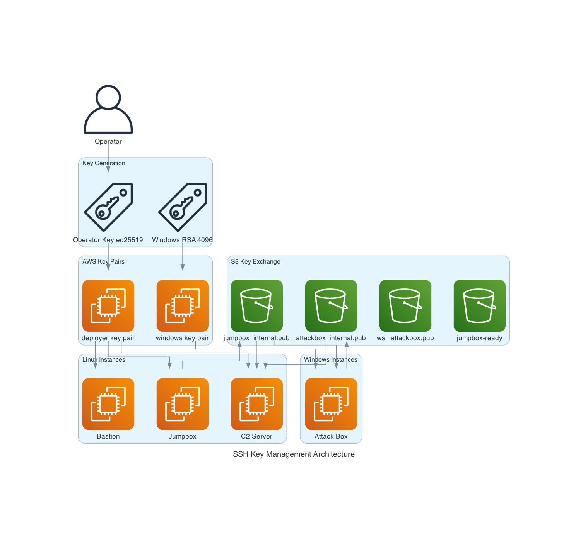

# SSH Key Management Architecture



## Overview

The project uses a layered SSH key architecture with three categories of keys. Private keys for inter-instance communication are generated on the hosts themselves and never pass through Terraform or the AWS API.

## Key Categories

### Category A: Operator External Key (User Access)

The operator's own SSH key (ed25519 or RSA) is registered as an AWS key pair via `var.user_public_key`. The private key never enters Terraform state. The operator authenticates with this key to the **Dashboard Server** — the AWS-hosted production control plane and sole SSH jump host — which is the entry point for every deployment. The key is also installed on deployment instances so the Dashboard Server can jump to them (and for break-glass direct SSH from `management_cidr_blocks`).

```
Operator laptop → public key → terraform.tfvars → aws_key_pair → Dashboard Server (sole jump)
                  private key stays on operator's laptop      └→ deployment instances (reached via the dashboard / break-glass)
```

**Primary use:** authorizes the operator to the Dashboard Server (SSH-key auth + IP allow-list).
**Also installed on:** all Linux instances (C2 team servers, proxy redirectors, GOAD jumpbox) so the Dashboard Server can jump to them.

### Category B: Windows Instance Key (Auto-Generated RSA)

Terraform generates a 4096-bit RSA key pair for Windows instances. AWS requires RSA for Windows AMI password decryption.

```hcl
resource "tls_private_key" "windows" {
  algorithm = "RSA"
  rsa_bits  = 4096
}
```

**Security note:** The private key IS stored in Terraform state (inherent limitation). The web app uses it to decrypt the EC2Launch v2 auto-generated Administrator password.

**Used by:** Attack Box (Windows Server 2022)

### Category C: Host-Generated Internal Keys (Inter-Instance)

Private keys are generated on the host at boot time and exchanged via S3. This is the most secure approach — private keys never leave their host.

| Key | Algorithm | Generated On | Public Key Shared Via |
|-----|-----------|-------------|----------------------|
| Jumpbox internal | ed25519 | Jumpbox cloud-init | S3 `keys/{id}/jumpbox_internal.pub` |
| Attack box internal | ed25519 | Attack box PowerShell | S3 `keys/{id}/attackbox_internal.pub` |
| Attack box WSL | ed25519 | Attack box WSL init | S3 `keys/{id}/wsl_attackbox_internal.pub` |

### Category D: Dashboard Server Internal Access (Jump Host)

The **Dashboard Server** is the production jump host and reaches deployment instances directly over VPC peering. It does not rely on the operator's laptop key for the last hop — it uses its own internal access:

- **SSM (preferred):** the dashboard issues `aws ssm send-command` / `start-session` to instances via their IAM roles + SSM agent — no SSH key distribution to the dashboard required for these.
- **Internal SSH key (Ansible):** for SSH-based actions (CS client tunnels, Ansible provisioning of GOAD), the dashboard holds an internal SSH private key whose public half is installed in instances' `authorized_keys`. This key lives on the dashboard server, not the operator's laptop.

The operator's external key (Category A) only gets them as far as the Dashboard Server; from there the dashboard's own SSM/internal-key access carries them to every instance.

## S3 Key Exchange Flow (GOAD-Only Mode)

The S3-based key exchange only activates for GOAD-only deployments (`enable_key_exchange = true`). C2/combined deployments skip this entirely — the attack box reaches the C2 server directly within the same VPC, and the Dashboard Server reaches both over VPC peering.

### Sequence

```
1. Jumpbox boots first
   ├── Generates ed25519 key pair locally
   ├── Uploads PUBLIC key to S3: keys/{id}/jumpbox_internal.pub
   └── Writes status beacon: status/{id}/jumpbox-ready

2. Team Server polls S3 (10s intervals, up to 10 min)
   ├── Downloads jumpbox_internal.pub from S3
   ├── Appends to /home/ubuntu/.ssh/authorized_keys
   └── Later: downloads attackbox keys too

3. Attack Box polls S3 (10s intervals, up to 10 min)
   ├── Downloads jumpbox_internal.pub from S3
   ├── Generates own ed25519 key pair locally
   ├── Uploads PUBLIC key to S3: keys/{id}/attackbox_internal.pub
   └── WSL also uploads: keys/{id}/wsl_attackbox_internal.pub
```

### S3 Prefix Structure

```
{project}-deploy-files-{hex}/
  keys/{project}/
    jumpbox_internal.pub        ← Written by jumpbox
    attackbox_internal.pub      ← Written by attack box
    wsl_attackbox_internal.pub  ← Written by attack box WSL
  status/{project}/
    jumpbox-ready               ← Readiness beacon
```

### S3 Lifecycle

- `keys/` objects auto-expire after **7 days** (only needed during bootstrap)
- `status/` objects auto-expire after **7 days**
- All objects removed on `terraform destroy` (`force_destroy = true`)

## SSH Hardening

All Linux instances apply these SSH settings via their init scripts:

| Setting | Value | Reason |
|---------|-------|--------|
| `PermitRootLogin` | `no` | Prevent direct root access |
| `PasswordAuthentication` | `no` | Key-only authentication |
| `MaxAuthTries` | `3` | Limit brute force attempts |
| `MaxSessions` | `10` | Reasonable session limit |
| `ClientAliveInterval` | `300` | 5-minute keepalive |
| `ClientAliveCountMax` | `2` | Disconnect after 10 min idle |
| `AllowAgentForwarding` | `yes` | Required for SSH agent forwarding through the Dashboard Server jump |
| `AllowTcpForwarding` | `yes` | Required for port forwarding to C2 |
| `X11Forwarding` | `no` | Not needed, reduces attack surface |

## IAM Permissions for Key Exchange

Key exchange uses the same IAM roles as S3 file access (see [IAM Security](./iam-security.md)):

| Action | Resource | Role |
|--------|----------|------|
| `s3:PutObject` | `keys/*` | GOAD role (jumpbox, attack box upload their public keys) |
| `s3:GetObject` | `keys/*` | GOAD role (team server, attack box download peer keys) |
| `s3:PutObject` | `status/*` | GOAD role (jumpbox writes readiness beacon) |
| `s3:ListBucket` | Bucket (prefix: `keys/*`, `status/*`) | GOAD role |

All conditioned on `SourceVpc = GOAD VPC` + `SecureTransport = true`.

## Ansible Playbooks (Supplementary)

These are manual-use tools, not part of the automated bootstrap:

| Playbook | Purpose |
|----------|---------|
| `ansible/playbooks/distribute-ssh-keys.yml` | Add SSH public keys to target hosts via `authorized_key` module |
| `ansible/playbooks/setup-jumpbox-keys.yml` | Generate RSA key on jumpbox (older approach, superseded by S3 exchange) |
| `scripts/utilities/setup-ssh-keys.sh` | CLI wrapper: generates key + calls Ansible |

## Operator Access Methods

The operator's external key authorizes to the **Dashboard Server**, which is the sole entry point and SSH jump host for everything below.

| Target | Method | Key Used |
|--------|--------|----------|
| Dashboard Server | SSH tunnel to EIP (`ssh -L 5000:localhost:5000 ubuntu@dashboard_eip`) + IP allow-list | Operator external key |
| C2 Team Server | `ssh -L 50050:c2_ip:50050 ubuntu@dashboard_eip` (or web UI terminal) | Operator external key → dashboard internal access |
| Attack Box (C2 mode) | RDP via dashboard tunnel (`-L 13389:ab_ip:3389`) | Operator external key → dashboard; Windows RSA for password |
| Attack Box (GOAD mode) | RDP via dashboard tunnel / SSH via dashboard | Dashboard internal access; Windows RSA / internal key |
| GOAD Jumpbox (provisioning host) | SSH via the Dashboard Server | Operator external key → dashboard internal access |

## Related Files

| File | Purpose |
|------|---------|
| `terraform/main.tf` (lines 214-250) | Key pair resources (`deployer`, `windows`) |
| `terraform/modules/goad/scripts/jumpbox_init.sh` | Jumpbox key generation + S3 upload |
| `terraform/modules/goad/scripts/teamserver_init.sh` | Team server key polling from S3 |
| `terraform/modules/attack_box/scripts/attack_box_init.ps1` | Attack box key exchange (Phase 7) |
| `terraform/modules/deployment_storage/main.tf` | SSH key exchange IAM policies |
| `ansible/playbooks/distribute-ssh-keys.yml` | Manual key distribution |
